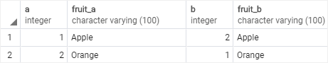
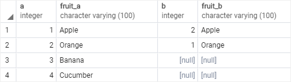
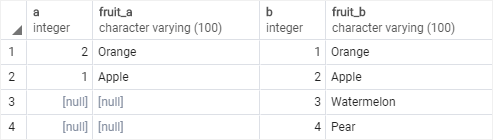
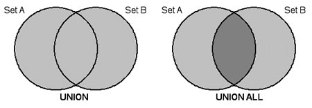

- [PostgreSQL JOINS - tutorial](https://www.postgresqltutorial.com/postgresql-tutorial/postgresql-joins/)
- [Для чего JOIN](#1)
- [Соединение INNER JOIN](#2)
    - [MySQL INNER JOIN - tutorial](https://www.mysqltutorial.org/mysql-inner-join.aspx)
- [Соединение LEFT | RIGHT JOIN](#3)
- [Соединение CROSS JOIN](#4)
- [Запросы на выборку из нескольких таблиц](#5)
- [Запросы для нескольких таблиц с группировкой](#6)
- [Запросы для нескольких таблиц со вложенными запросами](#7)
- [Вложенные запросы в операторе JOIN](#8)
- [Операция соединение, использование USING](#9)
- [Склеивание двух таблиц с использованием UNION](#10)
    - [MySQL UNION - tutorial](https://www.mysqltutorial.org/sql-union-mysql.aspx)

<!-- @@@@@@@@@@@@@@@@@@@@@@@@@@@@@@@@@@@@@@@@@@@@@@@@@@@@@@@@@@@@@@@@@@@@@@ -->

---

<h3 id="1" align="center">Для чего JOIN</h3>

В запросах SQL могут участвовать несколько таблиц базы данных. При этом
необходимо указать как эти таблицы соединены между собой.<br>
Операция соединения JOIN предназначена для обеспечения выборки данных из двух
таблиц и включения этих данных в один результирующий набор. При необходимости
соединения не двух, а нескольких таблиц, операция соединения применяется
несколько раз (последовательно).<br>
Операторы соединения входят в раздел FROM SQL запросов.

<!-- @@@@@@@@@@@@@@@@@@@@@@@@@@@@@@@@@@@@@@@@@@@@@@@@@@@@@@@@@@@@@@@@@@@@@@ -->

---

<h3 id="2" align="center">Соединение INNER JOIN</h3>

<p align="center"></p>
<p align="center"></p>

<p align="center">~~~</p>

__Результат запроса формируется так:__

1. каждая строка левой таблицы сопоставляется с каждой строкой правой таблицы;
2. для полученной строки проверяется условие соединения ON;
3. если условие истинно, в результирующую таблицу добавляется соответствующая
   строка;

<p align="center">~~~</p>

__Синтаксис:__

```sql
SELECT <tbl1>.<field1> AS <field_al1>,
       <tbl2>.<field2> AS <field_al2>,
       <tbl3>.<field3> AS <Field_al3>
  FROM <tbl_name1> AS <tbl1>
       INNER JOIN <tbl_name2> AS <tbl2>
               ON <join_condition>
       INNER JOIN <tbl_name3> AS <tbl3>
               ON <join_condition>
 WHERE <condition>
   ... ...;
```

<p align="center">~~~</p>

__Пример:__

Вывести название книг и их авторов.

<details><br><summary>Подчиненная таблица book</summary>

```text
book_id|title                |author_id|genre_id|price |amount|
-------+---------------------+---------+--------+------+------+
      1|Мастер и Маргарита   |        1|       1|670.99|     3|
      2|Белая гвардия        |        1|       1|540.50|     5|
      3|Идиот                |        2|       1|460.00|    10|
      4|Братья Карамазовы    |        2|       1|799.01|     3|
      5|Игрок                |        2|       1|480.50|    10|
      6|Стихотворения и поэмы|        3|       2|650.00|    15|
      7|Черный человек       |        3|       2|570.20|     6|
      8|Лирика               |        4|       2|518.99|     2|
```

<hr style="margin-left: 25%; margin-right: 25%;"></details>

<details><br><summary>Главная таблица author</summary>

```text
author_id|name_author     |
---------+----------------+
        1|Булгаков М.А.   |
        2|Достоевский Ф.М.|
        3|Есенин С.А.     |
        4|Пастернак Б.Л.  |
        5|Лермонтов М.Ю.  |
```

<hr style="margin-left: 25%; margin-right: 25%;"></details>

```sql
SELECT b.title,
       a.name_author
  FROM book AS b
       INNER JOIN author AS a
               ON b.author_id = a.author_id;
```
```text
title                |name_author     |
---------------------+----------------+
Мастер и Маргарита   |Булгаков М.А.   |
Белая гвардия        |Булгаков М.А.   |
Идиот                |Достоевский Ф.М.|
Братья Карамазовы    |Достоевский Ф.М.|
Игрок                |Достоевский Ф.М.|
Стихотворения и поэмы|Есенин С.А.     |
Черный человек       |Есенин С.А.     |
Лирика               |Пастернак Б.Л.  |
```

<p align="center">~~~</p>

__Задание:__

Вывести название, жанр и цену тех книг, количество которых больше 8, в
отсортированном по убыванию цены виде.

<details><br><summary>Подчиненная таблица book</summary>

```text
book_id|title                |author_id|genre_id|price |amount|
-------+---------------------+---------+--------+------+------+
      1|Мастер и Маргарита   |        1|       1|670.99|     3|
      2|Белая гвардия        |        1|       1|540.50|     5|
      3|Идиот                |        2|       1|460.00|    10|
      4|Братья Карамазовы    |        2|       1|799.01|     3|
      5|Игрок                |        2|       1|480.50|    10|
      6|Стихотворения и поэмы|        3|       2|650.00|    15|
      7|Черный человек       |        3|       2|570.20|     6|
      8|Лирика               |        4|       2|518.99|     2|
```

<hr style="margin-left: 25%; margin-right: 25%;"></details>

<details><br><summary>Главная таблица genre</summary>

```text
genre_id|name_genre |
--------+-----------+
       1|Роман      |
       2|Поэзия     |
       3|Приключения|
```

<hr style="margin-left: 25%; margin-right: 25%;"></details>

```sql
  SELECT b.title,
         g.name_genre,
         b.price
    FROM book AS b
         INNER JOIN genre AS g
                 ON b.genre_id = g.genre_id
   WHERE b.amount > 8
ORDER BY b.price DESC;
```
```text
title                |name_genre|price |
---------------------+----------+------+
Стихотворения и поэмы|Поэзия    |650.00|
Игрок                |Роман     |480.50|
Идиот                |Роман     |460.00|
```

<!-- @@@@@@@@@@@@@@@@@@@@@@@@@@@@@@@@@@@@@@@@@@@@@@@@@@@@@@@@@@@@@@@@@@@@@@ -->

---

<h3 id="3" align="center">Соединение LEFT | RIGHT JOIN</h3>

<table>
  <tr align="center">
    <td>
        <p>LEFT OUTER JOIN</p>
        <p></p>
        <p></p>
    </td>
    <td>
        <p>RIGHT OUTER JOIN</p>
        <p></p>
        <p></p>
    </td>
  </tr>
</table>

<p align="center"><b>LEFT JOIN</b></p>

__Результат запроса формируется так:__

1. в результирующую таблицу включается внутреннее соединение (INNER JOIN) левой
   и правой таблицы в соответствии с условием ON;
2. затем в результат добавляются те записи __ЛЕВОЙ__ таблицы, которые не вошли во
   внутреннее соединение на первом шаге, для таких записей соответствующие поля
   __ПРАВОЙ__ таблицы заполняются значениями NULL.

<p align="center">~~~</p>

__Синтаксис:__

```sql
SELECT <tbl_al1>.<field1> AS <field_al1>,
       <tbl_al2>.<field2> AS <field_al2>,
       <tbl_al3>.<field3> AS <field_al3>
 FROM <tbl_name1> AS <tbl_al1>
      LEFT JOIN <tbl_name2> AS <tbl_al2>
              ON <condition1>
      LEFT JOIN <tbl_name3> AS <tbl_al3>
              ON <condition2>
WHERE <condition>
```

<p align="center"><b>RIGHT JOIN</b></p>

__Результат запроса формируется так:__

1. в результирующую таблицу включается внутреннее соединение (INNER JOIN) левой
   и правой таблицы в соответствии с условием ON;
2. затем в результат добавляются те записи __ПРАВОЙ__ таблицы, которые не вошли во
   внутреннее соединение на первом шаге, для таких записей соответствующие поля
   __ЛЕВОЙ__ таблицы заполняются значениями NULL.

<p align="center">~~~</p>

__Синтаксис:__

```sql
SELECT <tbl_al1>.<field1> AS <field_al1>,
       <tbl_al2>.<field2> AS <field_al2>,
       <tbl_al3>.<field3> AS <field_al3>
 FROM <tbl_name1> AS <tbl_al1>
      RIGHT JOIN <tbl_name2> AS <tbl_al2>
              ON <condition1>
      RIGHT JOIN <tbl_name3> AS <tbl_al3>
              ON <condition2>
WHERE <condition>
```

---

__Пример:__

Вывести название всех книг каждого автора, если книг некоторых авторов в данный
момент нет на складе – вместо названия книги указать NULL.

<p align="center">~~~</p>

<details><br><summary>Подчиненная таблица book</summary>

```text
book_id|title                |author_id|genre_id|price |amount|
-------+---------------------+---------+--------+------+------+
      1|Мастер и Маргарита   |        1|       1|670.99|     3|
      2|Белая гвардия        |        1|       1|540.50|     5|
      3|Идиот                |        2|       1|460.00|    10|
      4|Братья Карамазовы    |        2|       1|799.01|     3|
      5|Игрок                |        2|       1|480.50|    10|
      6|Стихотворения и поэмы|        3|       2|650.00|    15|
      7|Черный человек       |        3|       2|570.20|     6|
      8|Лирика               |        4|       2|518.99|     2|
```

<hr style="margin-left: 25%; margin-right: 25%;"></details>

<details><br><summary>Главная таблица author</summary>

```text
author_id|name_author     |
---------+----------------+
        1|Булгаков М.А.   |
        2|Достоевский Ф.М.|
        3|Есенин С.А.     |
        4|Пастернак Б.Л.  |
        5|Лермонтов М.Ю.  |
```

<hr style="margin-left: 25%; margin-right: 25%;"></details>

<p align="center">LEFT JOIN</p>

```sql
SELECT a.name_author,
       b.title
  FROM author AS a
       LEFT JOIN book AS b
              ON a.author_id = b.author_id;
```
```text
name_author     |title                |
----------------+---------------------+
Булгаков М.А.   |Мастер и Маргарита   |
Булгаков М.А.   |Белая гвардия        |
Достоевский Ф.М.|Идиот                |
Достоевский Ф.М.|Братья Карамазовы    |
Достоевский Ф.М.|Игрок                |
Есенин С.А.     |Стихотворения и поэмы|
Есенин С.А.     |Черный человек       |
Пастернак Б.Л.  |Лирика               |
Лермонтов М.Ю.  |                     | <- Так как в таблице book нет книг Лермонтова, напротив этой фамилии стоит Null.
```

<p align="center">RIGHT JOIN</p>

```sql
SELECT b.title,
       a.name_author
  FROM book AS b
       RIGHT JOIN author AS a
               ON b.author_id = a.author_id;
```
```text
title                |name_author     |
---------------------+----------------+
Мастер и Маргарита   |Булгаков М.А.   |
Белая гвардия        |Булгаков М.А.   |
Идиот                |Достоевский Ф.М.|
Братья Карамазовы    |Достоевский Ф.М.|
Игрок                |Достоевский Ф.М.|
Стихотворения и поэмы|Есенин С.А.     |
Черный человек       |Есенин С.А.     |
Лирика               |Пастернак Б.Л.  |
                     |Лермонтов М.Ю.  | <- Так как в таблице book нет книг Лермонтова, напротив этой фамилии стоит Null.
```

---

__Задание:__

Вывести все жанры, которые не представлены в книгах на складе.

<details><br><summary>Подчиненная таблица book</summary>

```text
book_id|title                |author_id|genre_id|price |amount|
-------+---------------------+---------+--------+------+------+
      1|Мастер и Маргарита   |        1|       1|670.99|     3|
      2|Белая гвардия        |        1|       1|540.50|     5|
      3|Идиот                |        2|       1|460.00|    10|
      4|Братья Карамазовы    |        2|       1|799.01|     3|
      5|Игрок                |        2|       1|480.50|    10|
      6|Стихотворения и поэмы|        3|       2|650.00|    15|
      7|Черный человек       |        3|       2|570.20|     6|
      8|Лирика               |        4|       2|518.99|     2|
```

<hr style="margin-left: 25%; margin-right: 25%;"></details>

<details><br><summary>Главная таблица genre</summary>

```text
genre_id|name_genre |
--------+-----------+
       1|Роман      |
       2|Поэзия     |
       3|Приключения|
```

<hr style="margin-left: 25%; margin-right: 25%;"></details>

```sql
SELECT g.name_genre
  FROM genre AS g
       LEFT JOIN book AS b
              ON g.genre_id = b.genre_id
 WHERE ISNULL(b.title);
```
```text
name_genre |
-----------+
Приключения|
```

<!-- @@@@@@@@@@@@@@@@@@@@@@@@@@@@@@@@@@@@@@@@@@@@@@@@@@@@@@@@@@@@@@@@@@@@@@ -->

---

<h3 id="4" align="center">Соединение CROSS JOIN</h3>

__CROSS JOIN__ - оператор перекрёстного соединения, или декартово произведение
(перебор всех возможных комбинации).

Результат запроса формируется так: каждая строка одной таблицы соединяется с
каждой строкой другой таблицы, формируя в результате все возможные сочетания
строк двух таблиц.

<p align="center">~~~</p>

__Синтаксис:__

```sql
SELECT <tbl_al1>.<field1> AS <field_al1>,
       <tbl_al2>.<field2> AS <field_al2>,
       <tbl_al3>.<field3> AS <field_al3>
  FROM <tbl_name1> AS <tbl_al1>
       CROSS JOIN <tbl_name2> AS <tbl_al2>
              [ON <condition>]
       CROSS JOIN <tbl_name3> AS <tbl_al3>
              [ON <condition>]
 WHERE <condition>
   ... ...;
```

<p align="center">ИЛИ</p>

```sql
SELECT <tbl_al1>.<field1> AS <field_al1>,
       <tbl_al2>.<field2> AS <field_al2>,
       <tbl_al3>.<field3> AS <field_al3>
  FROM <tbl_name1> AS <tbl_al1>,
       <tbl_name2> AS <tbl_al2>,
       <tbl_name3> AS <tbl_al3>
 WHERE <condition>
   ... ...;
```

<p align="center">~~~</p>

__Пример:__

<details><br><summary>Таблица author</summary>

```text
author_id|name_author     |
---------+----------------+
        1|Булгаков М.А.   |
        2|Достоевский Ф.М.|
        3|Есенин С.А.     |
        4|Пастернак Б.Л.  |
        5|Лермонтов М.Ю.  |
```

<hr style="margin-left: 25%; margin-right: 25%;"></details>

<details><br><summary>Таблица genre</summary>

```text
genre_id|name_genre |
--------+-----------+
       1|Роман      |
       2|Поэзия     |
       3|Приключения|
```

<hr style="margin-left: 25%; margin-right: 25%;"></details>

```sql
SELECT b.name_author,
       g.name_genre
  FROM author AS b
       CROSS JOIN genre AS g;
```
<p align="center">ИЛИ</p>

```sql
SELECT b.name_author,
       g.name_genre
  FROM author AS b,
       genre AS g;
```
```text
name_author     |name_genre |
----------------+-----------+
Булгаков М.А.   |Приключения|
Булгаков М.А.   |Поэзия     |
Булгаков М.А.   |Роман      |
Достоевский Ф.М.|Приключения|
Достоевский Ф.М.|Поэзия     |
Достоевский Ф.М.|Роман      |
Есенин С.А.     |Приключения|
Есенин С.А.     |Поэзия     |
Есенин С.А.     |Роман      |
Пастернак Б.Л.  |Приключения|
Пастернак Б.Л.  |Поэзия     |
Пастернак Б.Л.  |Роман      |
Лермонтов М.Ю.  |Приключения|
Лермонтов М.Ю.  |Поэзия     |
Лермонтов М.Ю.  |Роман      |
```

<p align="center">~~~</p>

__Задача:__

Необходимо в каждом городе провести выставку книг каждого автора в течение 2020
года. Дату проведения выставки выбрать случайным образом. Создать запрос,
который выведет город, автора и дату проведения выставки. Последний столбец
назвать Дата. Информацию вывести, отсортировав сначала в алфавитном порядке по
названиям городов, а потом по убыванию дат проведения выставок.

<details><br><summary>Таблица city</summary>

```sql
CREATE TABLE IF NOT EXISTS city(
      city_id INT PRIMARY KEY AUTO_INCREMENT,
    name_city VARCHAR(50)
);

INSERT INTO city(name_city)
     VALUES ('Москва'),
            ('Санкт-Петербург'),
            ('Владивосток');
```

```text
city_id|name_city      |
-------+---------------+
      1|Москва         |
      2|Санкт-Петербург|
      3|Владивосток    |
```

<hr style="margin-left: 25%; margin-right: 25%;"></details>

<details><br><summary>Таблица author</summary>

```text
author_id|name_author     |
---------+----------------+
        1|Булгаков М.А.   |
        2|Достоевский Ф.М.|
        3|Есенин С.А.     |
        4|Пастернак Б.Л.  |
        5|Лермонтов М.Ю.  |
```

<hr style="margin-left: 25%; margin-right: 25%;"></details>

```sql
SELECT c.name_city,
       a.name_author,
       DATE_ADD('2020-01-01', INTERVAL FLOOR(RAND() * 365) DAY) AS Дата
  FROM city AS c
       CROSS JOIN author AS a
ORDER BY c.name_city ASC,
         Дата DESC;
```
```sql
SELECT c.name_city,
       a.name_author,
       DATE_ADD('2020-01-01', INTERVAL FLOOR(RAND() * 365) DAY) AS Дата
  FROM city AS c,
       author AS a
ORDER BY c.name_city ASC,
         Дата DESC;
```
```text
name_city      |name_author     |Дата      |
---------------+----------------+----------+
Владивосток    |Лермонтов М.Ю.  |2020-10-13|
Владивосток    |Пастернак Б.Л.  |2020-07-08|
Владивосток    |Есенин С.А.     |2020-06-07|
Владивосток    |Булгаков М.А.   |2020-03-22|
Владивосток    |Достоевский Ф.М.|2020-02-26|
Москва         |Булгаков М.А.   |2020-12-27|
Москва         |Есенин С.А.     |2020-12-22|
Москва         |Лермонтов М.Ю.  |2020-12-08|
Москва         |Пастернак Б.Л.  |2020-10-02|
Москва         |Достоевский Ф.М.|2020-07-27|
Санкт-Петербург|Булгаков М.А.   |2020-12-05|
Санкт-Петербург|Достоевский Ф.М.|2020-10-21|
Санкт-Петербург|Пастернак Б.Л.  |2020-08-29|
Санкт-Петербург|Лермонтов М.Ю.  |2020-08-28|
Санкт-Петербург|Есенин С.А.     |2020-06-15|
```

<!-- @@@@@@@@@@@@@@@@@@@@@@@@@@@@@@@@@@@@@@@@@@@@@@@@@@@@@@@@@@@@@@@@@@@@@@ -->

---

<h3 id="5" align="center">Запросы на выборку из нескольких таблиц</h3>

__Пример:__

Вывести информацию о тех книгах, их авторах и жанрах, цена которых принадлежит
интервалу от 500 до 700 рублей включительно.

<details><br><summary>Подчиненная таблица book</summary>

```text
book_id|title                |author_id|genre_id|price |amount|
-------+---------------------+---------+--------+------+------+
      1|Мастер и Маргарита   |        1|       1|670.99|     3| <-
      2|Белая гвардия        |        1|       1|540.50|     5| <-
      3|Идиот                |        2|       1|460.00|    10|
      4|Братья Карамазовы    |        2|       1|799.01|     3|
      5|Игрок                |        2|       1|480.50|    10|
      6|Стихотворения и поэмы|        3|       2|650.00|    15| <-
      7|Черный человек       |        3|       2|570.20|     6| <-
      8|Лирика               |        4|       2|518.99|     2| <-
```

<hr style="margin-left: 25%; margin-right: 25%;"></details>

<details><br><summary>Главные таблицы author и genre</summary>

```text
author_id|name_author     |
---------+----------------+
        1|Булгаков М.А.   |
        2|Достоевский Ф.М.|
        3|Есенин С.А.     |
        4|Пастернак Б.Л.  |
        5|Лермонтов М.Ю.  |
```
```text
genre_id|name_genre |
--------+-----------+
       1|Роман      |
       2|Поэзия     |
       3|Приключения|
```

<hr style="margin-left: 25%; margin-right: 25%;"></details>

```sql
SELECT b.title,
       a.name_author,
       g.name_genre
  FROM book AS b
       INNER JOIN author AS a
               ON b.author_id = a.author_id
       INNER JOIN genre AS g
               ON b.genre_id = g.genre_id
 WHERE b.price BETWEEN 500 AND 700;
```
```text
title                |name_author   |name_genre|
---------------------+--------------+----------+
Мастер и Маргарита   |Булгаков М.А. |Роман     |
Белая гвардия        |Булгаков М.А. |Роман     |
Стихотворения и поэмы|Есенин С.А.   |Поэзия    |
Черный человек       |Есенин С.А.   |Поэзия    |
Лирика               |Пастернак Б.Л.|Поэзия    |
```

<p align="center">~~~</p>

__Задание:__

Вывести информацию о книгах (жанр, книга, автор), относящихся к жанру,
включающему слово «роман» в отсортированном по названиям книг виде.

<details><br><summary>Подчиненная таблица book</summary>

```text
book_id|title                |author_id|genre_id|price |amount|
-------+---------------------+---------+--------+------+------+
      1|Мастер и Маргарита   |        1|       1|670.99|     3| <-
      2|Белая гвардия        |        1|       1|540.50|     5| <-
      3|Идиот                |        2|       1|460.00|    10| <-
      4|Братья Карамазовы    |        2|       1|799.01|     3| <-
      5|Игрок                |        2|       1|480.50|    10| <-
      6|Стихотворения и поэмы|        3|       2|650.00|    15|
      7|Черный человек       |        3|       2|570.20|     6|
      8|Лирика               |        4|       2|518.99|     2|
```

<hr style="margin-left: 25%; margin-right: 25%;"></details>

<details><br><summary>Главные таблицы author и genre</summary>

```text
author_id|name_author     |
---------+----------------+
        1|Булгаков М.А.   |
        2|Достоевский Ф.М.|
        3|Есенин С.А.     |
        4|Пастернак Б.Л.  |
        5|Лермонтов М.Ю.  |
```
```text
genre_id|name_genre |
--------+-----------+
       1|Роман      |
       2|Поэзия     |
       3|Приключения|
```

<hr style="margin-left: 25%; margin-right: 25%;"></details>

```sql
  SELECT g.name_genre,
         b.title,
         a.name_author
    FROM book AS b
         INNER JOIN genre AS g
                 ON b.genre_id = g.genre_id
                AND g.name_genre LIKE '%роман%'
         INNER JOIN author AS a
                 ON b.author_id = a.author_id
ORDER BY b.title ASC;
```
```text
name_genre|title             |name_author     |
----------+------------------+----------------+
Роман     |Белая гвардия     |Булгаков М.А.   |
Роман     |Братья Карамазовы |Достоевский Ф.М.|
Роман     |Игрок             |Достоевский Ф.М.|
Роман     |Идиот             |Достоевский Ф.М.|
Роман     |Мастер и Маргарита|Булгаков М.А.   |
```

<!-- @@@@@@@@@@@@@@@@@@@@@@@@@@@@@@@@@@@@@@@@@@@@@@@@@@@@@@@@@@@@@@@@@@@@@@ -->

---

<h3 id="6" align="center">Запросы для нескольких таблиц с группировкой</h3>

__Пример:__

Вывести количество различных книг каждого автора. Информацию отсортировать в
алфавитном порядке по фамилиям авторов.

<details><br><summary>Подчиненная таблица book</summary>

```text
book_id|title                |author_id|genre_id|price |amount|
-------+---------------------+---------+--------+------+------+
      1|Мастер и Маргарита   |        1|       1|670.99|     3|
      2|Белая гвардия        |        1|       1|540.50|     5|
      3|Идиот                |        2|       1|460.00|    10|
      4|Братья Карамазовы    |        2|       1|799.01|     3|
      5|Игрок                |        2|       1|480.50|    10|
      6|Стихотворения и поэмы|        3|       2|650.00|    15|
      7|Черный человек       |        3|       2|570.20|     6|
      8|Лирика               |        4|       2|518.99|     2|
```

<hr style="margin-left: 25%; margin-right: 25%;"></details>

<details><br><summary>Главная таблица author</summary>

```text
author_id|name_author     |
---------+----------------+
        1|Булгаков М.А.   |
        2|Достоевский Ф.М.|
        3|Есенин С.А.     |
        4|Пастернак Б.Л.  |
        5|Лермонтов М.Ю.  |
```

<hr style="margin-left: 25%; margin-right: 25%;"></details>

```sql
  SELECT a.name_author,
         COUNT(b.title) AS Количество
    FROM book AS b
         RIGHT JOIN author AS a
                 ON b.author_id = a.author_id
GROUP BY a.name_author
ORDER BY a.name_author ASC;
```
```text
name_author     |Количество|
----------------+----------+
Булгаков М.А.   |         2|
Достоевский Ф.М.|         3|
Есенин С.А.     |         2|
Лермонтов М.Ю.  |         0|
Пастернак Б.Л.  |         1|
```

<p align="center">~~~</p>

__Задание:__

Посчитать количество экземпляров книг каждого автора из таблицы author. 
Вывести тех авторов, количество книг которых меньше 10, в отсортированном по
возрастанию количества виде. Последний столбец назвать Количество.

<details><br><summary>Подчиненная таблица book</summary>

```text
book_id|title                |author_id|genre_id|price |amount|
-------+---------------------+---------+--------+------+------+
      1|Мастер и Маргарита   |        1|       1|670.99|     3|
      2|Белая гвардия        |        1|       1|540.50|     5|
      3|Идиот                |        2|       1|460.00|    10|
      4|Братья Карамазовы    |        2|       1|799.01|     3|
      5|Игрок                |        2|       1|480.50|    10|
      6|Стихотворения и поэмы|        3|       2|650.00|    15|
      7|Черный человек       |        3|       2|570.20|     6|
      8|Лирика               |        4|       2|518.99|     2|
```

<hr style="margin-left: 25%; margin-right: 25%;"></details>

<details><br><summary>Главная таблица author</summary>

```text
author_id|name_author     |
---------+----------------+
        1|Булгаков М.А.   |
        2|Достоевский Ф.М.|
        3|Есенин С.А.     |
        4|Пастернак Б.Л.  |
        5|Лермонтов М.Ю.  |
```

<hr style="margin-left: 25%; margin-right: 25%;"></details>

```sql
  SELECT a.name_author,
         SUM(b.amount) AS Количество
    FROM book AS b
         RIGHT JOIN author AS a
                 ON b.author_id = a.author_id
GROUP BY a.name_author
--HAVING Количество < 10 (In MySQL platform I can do, but not in SQL standard);
  HAVING SUM(b.amount) < 10
      OR COUNT(b.title) = 0
ORDER BY Количество ASC;
```
```text
name_author   |Количество|
--------------+----------+
Лермонтов М.Ю.|          |
Пастернак Б.Л.|         2|
Булгаков М.А. |         8|
```

<!-- @@@@@@@@@@@@@@@@@@@@@@@@@@@@@@@@@@@@@@@@@@@@@@@@@@@@@@@@@@@@@@@@@@@@@@ -->

---

<h3 id="7" align="center">Запросы для нескольких таблиц со вложенными запросами</h3>

__Пример:__

Вывести авторов, общее количество книг которых на складе максимально.

<details><br><summary>Подчиненная таблица book</summary>

```text
book_id|title                |author_id|genre_id|price |amount|
-------+---------------------+---------+--------+------+------+
      1|Мастер и Маргарита   |        1|       1|670.99|     3|
      2|Белая гвардия        |        1|       1|540.50|     5|
      3|Идиот                |        2|       1|460.00|    10|
      4|Братья Карамазовы    |        2|       1|799.01|     3|
      5|Игрок                |        2|       1|480.50|    10|
      6|Стихотворения и поэмы|        3|       2|650.00|    15|
      7|Черный человек       |        3|       2|570.20|     6|
      8|Лирика               |        4|       2|518.99|     2|
```

<hr style="margin-left: 25%; margin-right: 25%;"></details>

<details><br><summary>Главная таблица author</summary>

```text
author_id|name_author     |
---------+----------------+
        1|Булгаков М.А.   |
        2|Достоевский Ф.М.|
        3|Есенин С.А.     |
        4|Пастернак Б.Л.  |
        5|Лермонтов М.Ю.  |
```

<hr style="margin-left: 25%; margin-right: 25%;"></details>

<details><br><summary>Вложенные запросы</summary>

```sql
  SELECT SUM(amount) AS sum_amount
    FROM book
GROUP BY author_id;
```
```text
sum_amount|
----------+
         8|
        23|
        21|
         2|
```

<p align="center">~~~</p>

```sql
SELECT MAX(temp.sum_amount)
  FROM (  SELECT SUM(amount) AS sum_amount
            FROM book
        GROUP BY author_id) AS temp;
```
```text
MAX(temp.sum_amount)|
--------------------+
                  23|
```

<hr style="margin-left: 25%; margin-right: 25%;"></details>

```sql
  SELECT a.name_author,
         SUM(b.amount) AS Количество
    FROM book AS b
         INNER JOIN author AS a
                 ON b.author_id = a.author_id
GROUP BY b.author_id
  HAVING SUM(b.amount) = (SELECT MAX(temp.sum_amount)
                            FROM (  SELECT SUM(amount) AS sum_amount
                                      FROM book
                                  GROUP BY author_id) AS temp);
```
```text
name_author     |Количество|
----------------+----------+
Достоевский Ф.М.|        23|
```

<p align="center">~~~</p>

__Задача:__

Вывести в алфавитном порядке всех авторов, которые пишут только в одном жанре.
Поскольку у нас в таблицах так занесены данные, что у каждого автора книги
только в одном жанре, для этого запроса внесем изменения в таблицу book. Пусть
у нас книга Есенина «Черный человек» относится к жанру «Роман», а книга
Булгакова «Белая гвардия» к «Приключениям» (эти изменения в таблицы уже внесены).

<details><br><summary>Подчиненная таблица book до</summary>

```text
book_id|title                |author_id|genre_id|price |amount|
-------+---------------------+---------+--------+------+------+
      1|Мастер и Маргарита   |        1|       1|670.99|     3|
      2|Белая гвардия        |        1|       1|540.50|     5| <-
      3|Идиот                |        2|       1|460.00|    10|
      4|Братья Карамазовы    |        2|       1|799.01|     3|
      5|Игрок                |        2|       1|480.50|    10|
      6|Стихотворения и поэмы|        3|       2|650.00|    15|
      7|Черный человек       |        3|       2|570.20|     6| <-
      8|Лирика               |        4|       2|518.99|     2|
```

<hr style="margin-left: 25%; margin-right: 25%;"></details>

<details><br><summary>Изменение жанров</summary>

```sql
UPDATE book
   SET genre_id = IF(title LIKE '%черный человек%', 1,
                  IF(title LIKE '%белая гвардия%', 3,
                  genre_id))
 WHERE REGEXP_LIKE(title, '(черный человек|белая гвардия)', 'i');
```

<hr style="margin-left: 25%; margin-right: 25%;"></details>

<details><br><summary>Подчиненная таблица book после</summary>

```text
book_id|title                |author_id|genre_id|price |amount|
-------+---------------------+---------+--------+------+------+
      1|Мастер и Маргарита   |        1|       1|670.99|     3|
      2|Белая гвардия        |        1|       3|540.50|     5| <-
      3|Идиот                |        2|       1|460.00|    10|
      4|Братья Карамазовы    |        2|       1|799.01|     3|
      5|Игрок                |        2|       1|480.50|    10|
      6|Стихотворения и поэмы|        3|       2|650.00|    15|
      7|Черный человек       |        3|       1|570.20|     6| <-
      8|Лирика               |        4|       2|518.99|     2|
```

<hr style="margin-left: 25%; margin-right: 25%;"></details>

<details><br><summary>Главные таблицы genre и author</summary>

```text
genre_id|name_genre |
--------+-----------+
       1|Роман      |
       2|Поэзия     |
       3|Приключения|
```

```text
author_id|name_author     |
---------+----------------+
        1|Булгаков М.А.   |
        2|Достоевский Ф.М.|
        3|Есенин С.А.     |
        4|Пастернак Б.Л.  |
        5|Лермонтов М.Ю.  |
```

<hr style="margin-left: 25%; margin-right: 25%;"></details>

<p align="center">~~~</p>

<details><br><summary>Вложенный запрос</summary>

```sql
  SELECT a.name_author
    FROM book AS b
         INNER JOIN author AS a
                 ON b.author_id = a.author_id
GROUP BY a.name_author
  HAVING COUNT(DISTINCT genre_id) = 1;
```
```text
name_author     |
----------------+
Достоевский Ф.М.|
Пастернак Б.Л.  |
```

<hr style="margin-left: 25%; margin-right: 25%;"></details>

```sql
  SELECT a.name_author
    FROM book AS b
         INNER JOIN author AS a
                 ON b.author_id = a.author_id
GROUP BY a.name_author
  HAVING a.name_author IN (  SELECT a.name_author
                               FROM book AS b
                                    INNER JOIN author AS a
                                            ON b.author_id = a.author_id
                           GROUP BY a.name_author
                             HAVING COUNT(DISTINCT genre_id) = 1)
ORDER BY a.name_author ASC;
```
```text
name_author     |
----------------+
Достоевский Ф.М.|
Пастернак Б.Л.  |
```

<p align="center"><b>Без вложенного запроса</b></p>

```sql
  SELECT a.name_author
    FROM book AS b
         INNER JOIN author AS a
                 ON b.author_id = a.author_id
GROUP BY b.author_id
  HAVING COUNT(DISTINCT b.genre_id) = 1
ORDER BY a.name_author ASC;
```
```text
name_author     |
----------------+
Достоевский Ф.М.|
Пастернак Б.Л.  |
```

<!-- @@@@@@@@@@@@@@@@@@@@@@@@@@@@@@@@@@@@@@@@@@@@@@@@@@@@@@@@@@@@@@@@@@@@@@ -->

---

<h3 id="8" align="center">Вложенные запросы в операторе JOIN</h3>

Вложенные запросы могут использоваться как справа, так и слева от оператора
JOIN. При этом им необходимо присваивать имя, которое записывается сразу после
закрывающей скобки вложенного запроса.

__Синтаксис:__

```sql
FROM <tbl_name1> AS <tbl_al1>
     [INNER|LEFT|RIGHT] JOIN (SELECT ...
                                FROM ...
                                 ... ...) AS <tbl_al2>
                          ON <condition>;
```
```sql
FROM (SELECT ...
        FROM ...
         ... ...) AS <tbl_al1>
     [INNER|LEFT|RIGHT] JOIN <tbl_name2> AS <tbl_al2>
                          ON <condition>;
```

<p align="center">~~~</p>

__Пример:__

Вывести автора и название жанра, пишущих книги в самом популярном жанре.
Указать этот жанр. Самым популярным считать жанр, общее количество экземпляров
книг которого на складе максимально.

<details><br><summary>Главые таблицы genre и author</summary>

```text
genre_id|name_genre |
--------+-----------+
       1|Роман      |
       2|Поэзия     |
       3|Приключения|
```
```text
author_id|name_author     |
---------+----------------+
        1|Булгаков М.А.   |
        2|Достоевский Ф.М.|
        3|Есенин С.А.     |
        4|Пастернак Б.Л.  |
        5|Лермонтов М.Ю.  |
```

<hr style="margin-left: 25%; margin-right: 25%;"></details>

<details><br><summary>Подчиненная таблица book</summary>

```text
book_id|title                |author_id|genre_id|price |amount|
-------+---------------------+---------+--------+------+------+
      1|Мастер и Маргарита   |        1|       1|670.99|     3| <-3+5+3+10+10=31
      2|Белая гвардия        |        1|       1|540.50|     5| <-3+5+3+10+10=31
      3|Братья Карамазовы    |        2|       1|799.01|     3| <-3+5+3+10+10=31
      4|Игрок                |        2|       1|480.50|    10| <-3+5+3+10+10=31
      5|Стихотворения и поэмы|        3|       2|650.00|    15| <-    15+6+10=31
      6|Черный человек       |        3|       2|570.20|     6| <-    15+6+10=31
      7|Лирика               |        4|       2|518.99|    10| <-    15+6+10=31
      8|Идиот                |        2|       1|460.00|    10| <-3+5+3+10+10=31
      9|Герой нашего времени |        5|       3|570.59|     2|
     10|Доктор Живаго        |        4|       3|740.50|     5|
```

<hr style="margin-left: 25%; margin-right: 25%;"></details>

<details><br><summary>Под-запросы</summary>

Находим максимальное число книг для одного жанра

```sql
  SELECT SUM(amount) AS sum_amount
    FROM book
GROUP BY genre_id
ORDER BY sum_amount DESC
   LIMIT 1;
```
```text
sum_amount|
----------+
        31|
```

<p align="center">~~~</p>

Формируем таблицу с id жанра и его кол-во

```sql
  SELECT genre_id,
         SUM(amount) AS sum_amount
    FROM book
GROUP BY genre_id;
```
```text
genre_id|sum_amount|
--------+----------+
       1|        31| <-
       2|        31| <-
       3|         7|
```

<p align="center">~~~</p>

Отбираем id только тех жанров кол-во которых равно максимальному

```sql
SELECT t1.genre_id
  FROM (  SELECT genre_id,
                 SUM(amount) AS sum_amount
            FROM book
        GROUP BY genre_id) AS t1
        INNER JOIN (  SELECT SUM(amount) AS sum_amount
                        FROM book
                    GROUP BY genre_id
                    ORDER BY sum_amount DESC
                       LIMIT 1) AS t2
                ON t1.sum_amount = t2.sum_amount;
```
```text
genre_id|
--------+
       1|
       2|
```

<hr style="margin-left: 25%; margin-right: 25%;"></details>

<details><br><summary><b>Вариант решения 1:</b></summary>

Сначала группируем все записи, а потом отсеиваем ненужные группы, данный способ
не лучший, так как мы группируем записи которые на самом деле нам не нужны.

```sql
  SELECT a.name_author,
         g.name_genre
    FROM book as b
         INNER JOIN author AS a
                 ON b.author_id = a.author_id
         INNER JOIN genre AS g
                 ON b.genre_id = g.genre_id
GROUP BY b.genre_id,
         a.name_author,
         g.name_genre
  HAVING b.genre_id IN (SELECT t1.genre_id
                          FROM (  SELECT genre_id,
                                         SUM(amount) AS sum_amount
                                    FROM book
                                GROUP BY genre_id) AS t1
                                INNER JOIN (  SELECT SUM(amount) AS sum_amount
                                                FROM book
                                            GROUP BY genre_id
                                            ORDER BY sum_amount DESC
                                            LIMIT 1) AS t2
                                        ON t1.sum_amount = t2.sum_amount);
```
```text
name_author     |name_genre|
----------------+----------+
Булгаков М.А.   |Роман     |
Достоевский Ф.М.|Роман     |
Есенин С.А.     |Поэзия    |
Пастернак Б.Л.  |Поэзия    |
```

<hr style="margin-left: 25%; margin-right: 25%;"></details>

<details><br><summary><b>Вариант решения 2 (эффективный):</b></summary>

Данный вариант наиболее эффективен и менее ресурса-затратный, так как мы уже
во-время объединения таблицы book и genre отсеиваем те записи book у которых
жанр не является популярным тем самым затем при группировке мы не будем
группировать те записи которые в конечном итоге мы отсеем.

```sql
SELECT a.name_author,
       g.name_genre
  FROM book as b
       INNER JOIN author AS a
               ON b.author_id = a.author_id
       INNER JOIN genre AS g
               ON b.genre_id = g.genre_id
              AND b.genre_id IN (SELECT t1.genre_id
                                   FROM (  SELECT genre_id,
                                                  SUM(amount) AS sum_amount
                                             FROM book
                                         GROUP BY genre_id) AS t1
                                         INNER JOIN (  SELECT SUM(amount) AS sum_amount
                                                         FROM book
                                                     GROUP BY genre_id
                                                     ORDER BY sum_amount DESC
                                                     LIMIT 1) AS t2
                                                 ON t1.sum_amount = t2.sum_amount)
GROUP BY b.genre_id,
         a.name_author,
         g.name_genre;
```
```text
name_author     |name_genre|
----------------+----------+
Булгаков М.А.   |Роман     |
Достоевский Ф.М.|Роман     |
Есенин С.А.     |Поэзия    |
Пастернак Б.Л.  |Поэзия    |
```

<hr style="margin-left: 25%; margin-right: 25%;"></details>

<p align="center">~~~</p>

__Задание:__

Вывести информацию о книгах (название книги, фамилию и инициалы автора,
название жанра, цену и количество экземпляров книги), написанных в самых
популярных жанрах, в отсортированном в алфавитном порядке по названию книг
виде. Самым популярным считать жанр, общее количество экземпляров книг которого
на складе максимально.

<details><br><summary>Главые таблицы genre и author</summary>

```text
genre_id|name_genre |
--------+-----------+
       1|Роман      |
       2|Поэзия     |
       3|Приключения|
```
```text
author_id|name_author     |
---------+----------------+
        1|Булгаков М.А.   |
        2|Достоевский Ф.М.|
        3|Есенин С.А.     |
        4|Пастернак Б.Л.  |
        5|Лермонтов М.Ю.  |
```

<hr style="margin-left: 25%; margin-right: 25%;"></details>

<details><br><summary>Подчиненная таблица book</summary>

```text
book_id|title                |author_id|genre_id|price |amount|
-------+---------------------+---------+--------+------+------+
      1|Мастер и Маргарита   |        1|       1|670.99|     3| <-3+5+3+10+10=31
      2|Белая гвардия        |        1|       1|540.50|     5| <-3+5+3+10+10=31
      3|Братья Карамазовы    |        2|       1|799.01|     3| <-3+5+3+10+10=31
      4|Игрок                |        2|       1|480.50|    10| <-3+5+3+10+10=31
      5|Стихотворения и поэмы|        3|       2|650.00|    15| <-    15+6+10=31
      6|Черный человек       |        3|       2|570.20|     6| <-    15+6+10=31
      7|Лирика               |        4|       2|518.99|    10| <-    15+6+10=31
      8|Идиот                |        2|       1|460.00|    10| <-3+5+3+10+10=31
      9|Герой нашего времени |        5|       3|570.59|     2|
     10|Доктор Живаго        |        4|       3|740.50|     5|
```

<hr style="margin-left: 25%; margin-right: 25%;"></details>

<details><br><summary>Под-запросы</summary>

Найти максимальное число книг для жанра

```sql
  SELECT SUM(amount) AS sum_amount
    FROM book
GROUP BY genre_id
ORDER BY sum_amount DESC
   LIMIT 1;
```
```text
sum_amount|
----------+
        31|
```

<p align="center">~~~</p>

Для каждого жанра найти сумму книг

```sql
  SELECT genre_id,
         SUM(amount) AS sum_amount
    FROM book
GROUP BY genre_id;
```
```text
genre_id|sum_amount|
--------+----------+
       1|        31|
       2|        31|
       3|         7|
```

<p align="center">~~~</p>

Отобрать id только тех жанров кол-во которых равна кол-ву популярных жанров

```sql
SELECT t1.genre_id
  FROM (  SELECT genre_id,
                 SUM(amount) AS sum_amount
            FROM book
        GROUP BY genre_id) AS t1
       INNER JOIN (  SELECT SUM(amount) AS sum_amount
                       FROM book
                   GROUP BY genre_id
                   ORDER BY sum_amount DESC
                      LIMIT 1) AS t2
               ON t1.sum_amount = t2.sum_amount;
```
```text
genre_id|
--------+
       1|
       2|
```

<hr style="margin-left: 25%; margin-right: 25%;"></details>

```sql
SELECT b.title,
       a.name_author,
       g.name_genre,
       b.price,
       b.amount
  FROM book AS b
       INNER JOIN author AS a
               ON b.author_id = a.author_id
       INNER JOIN genre AS g
               ON b.genre_id = g.genre_id
              AND b.genre_id IN (SELECT t1.genre_id
                                   FROM (  SELECT genre_id,
                                                  SUM(amount) AS sum_amount
                                             FROM book
                                         GROUP BY genre_id) AS t1
                                        INNER JOIN (  SELECT SUM(amount) AS sum_amount
                                                        FROM book
                                                    GROUP BY genre_id
                                                    ORDER BY sum_amount DESC
                                                       LIMIT 1) AS t2
                                                ON t1.sum_amount = t2.sum_amount)
GROUP BY b.author_id,
         b.title,
         a.name_author,
         g.name_genre,
         b.price,
         b.amount
ORDER BY b.title ASC;
```
```text
title                |name_author     |name_genre|price |amount|
---------------------+----------------+----------+------+------+
Белая гвардия        |Булгаков М.А.   |Роман     |540.50|     5|
Братья Карамазовы    |Достоевский Ф.М.|Роман     |799.01|     3|
Игрок                |Достоевский Ф.М.|Роман     |480.50|    10|
Идиот                |Достоевский Ф.М.|Роман     |460.00|    10|
Лирика               |Пастернак Б.Л.  |Поэзия    |518.99|    10|
Мастер и Маргарита   |Булгаков М.А.   |Роман     |670.99|     3|
Стихотворения и поэмы|Есенин С.А.     |Поэзия    |650.00|    15|
Черный человек       |Есенин С.А.     |Поэзия    |570.20|     6|
```

<!-- @@@@@@@@@@@@@@@@@@@@@@@@@@@@@@@@@@@@@@@@@@@@@@@@@@@@@@@@@@@@@@@@@@@@@@ -->

---

<h3 id="9" align="center">Операция соединение, использование USING</h3>

USING позволяет указать набор столбцов, которые есть в обеих объединяемых
таблицах. Если база данных хорошо спроектирована, а каждый внешний ключ имеет
такое же имя, как и соответствующий первичный ключ (например, genre.genre_id =
book.genre_id), тогда можно использовать предложение USING для реализации
операции JOIN.

При этом после SELECT, при использовании столбцов из USING(), необязательно
указывать, из какой именно таблицы берется столбец.

<p align="center"><b>Без USING</b></p>

```sql
SELECT b.title,
       a.name_author,
       b.author_id
  FROM book AS b
       INNER JOIN author AS a
               ON b.author_id = a.author_id;
```

<details><br><summary>Результат запроса</summary>

```text
title                |name_author     |author_id|
---------------------+----------------+---------+
Мастер и Маргарита   |Булгаков М.А.   |        1|
Белая гвардия        |Булгаков М.А.   |        1|
Братья Карамазовы    |Достоевский Ф.М.|        2|
Игрок                |Достоевский Ф.М.|        2|
Идиот                |Достоевский Ф.М.|        2|
Стихотворения и поэмы|Есенин С.А.     |        3|
Черный человек       |Есенин С.А.     |        3|
Лирика               |Пастернак Б.Л.  |        4|
Доктор Живаго        |Пастернак Б.Л.  |        4|
Герой нашего времени |Лермонтов М.Ю.  |        5|
```

<hr style="margin-left: 25%; margin-right: 25%;"></details>

<p align="center"><b>Используя USING</b></p>

```sql
SELECT b.title,
       a.name_author,
       b.author_id
  FROM book AS b
       INNER JOIN author AS a USING(author_id);
```

<details><br><summary>Результат запроса</summary>

```text
title                |name_author     |author_id|
---------------------+----------------+---------+
Мастер и Маргарита   |Булгаков М.А.   |        1|
Белая гвардия        |Булгаков М.А.   |        1|
Братья Карамазовы    |Достоевский Ф.М.|        2|
Игрок                |Достоевский Ф.М.|        2|
Идиот                |Достоевский Ф.М.|        2|
Стихотворения и поэмы|Есенин С.А.     |        3|
Черный человек       |Есенин С.А.     |        3|
Лирика               |Пастернак Б.Л.  |        4|
Доктор Живаго        |Пастернак Б.Л.  |        4|
Герой нашего времени |Лермонтов М.Ю.  |        5|
```

<hr style="margin-left: 25%; margin-right: 25%;"></details>

<p align="center">~~~</p>

__Задание:__

Если в таблицах supply и book есть одинаковые книги, которые имеют равную цену,
вывести их название и автора, а также посчитать общее количество экземпляров
книг в таблицах supply и book, столбцы назвать Название, Автор и Количество.

<details><br><summary>Таблица author</summary>

```text
author_id|name_author     |
---------+----------------+
        1|Булгаков М.А.   |
        2|Достоевский Ф.М.|
        3|Есенин С.А.     |
        4|Пастернак Б.Л.  |
        5|Лермонтов М.Ю.  |
```

<hr style="margin-left: 25%; margin-right: 25%;"></details>

<details><br><summary>Таблица supply</summary>

```text
supply_id|title          |author          |price |amount|
---------+---------------+----------------+------+------+
        1|Доктор Живаго  |Пастернак Б.Л.  |618.99|     3|
        2|Черный человек |Есенин С.А.     |570.20|     6| <-
        3|Евгений Онегин |Пушкин А.С.     |440.80|     5|
        4|Идиот          |Достоевский Ф.М.|360.80|     3|
```

<hr style="margin-left: 25%; margin-right: 25%;"></details>

<details><br><summary>Таблица book</summary>

```text
book_id|title                |author_id|genre_id|price |amount|
-------+---------------------+---------+--------+------+------+
      1|Мастер и Маргарита   |        1|       1|670.99|     3|
      2|Белая гвардия        |        1|       1|540.50|     5|
      3|Братья Карамазовы    |        2|       1|799.01|     3|
      4|Игрок                |        2|       1|480.50|    10|
      5|Стихотворения и поэмы|        3|       2|650.00|    15|
      6|Черный человек       |        3|       2|570.20|     6| <-
      7|Лирика               |        4|       2|518.99|    10|
      8|Идиот                |        2|       1|460.00|    10|
      9|Герой нашего времени |        5|       3|570.59|     2|
     10|Доктор Живаго        |        4|       3|740.50|     5|
```

<hr style="margin-left: 25%; margin-right: 25%;"></details>

```sql
SELECT b.title AS Название,
       a.name_author AS Автор,
       b.amount + s.amount AS Количество
  FROM book AS b
       INNER JOIN author AS a USING(author_id)
       INNER JOIN supply AS s
               ON a.name_author LIKE s.author
              AND b.price = s.price;
```
```text
Название      |Автор      |Количество|
--------------+-----------+----------+
Черный человек|Есенин С.А.|        12|
```

<!-- @@@@@@@@@@@@@@@@@@@@@@@@@@@@@@@@@@@@@@@@@@@@@@@@@@@@@@@@@@@@@@@@@@@@@@ -->

---

<h3 id="10" align="center">Склеивание двух таблиц с использованием UNION</h3>

<p align="center"></p>

Оператор UNION используется для объединения двух и более SQL запросов, каждый
запрос должен возвращать одинаковое количество столбцов и совместимые типы
возвращаемых данных.

В результате выполнения этой конструкции будет выведена таблица, имена столбцов
которой соответствуют именам столбцов в первом запросе. А в таблице результата
сначала отображаются записи первого запроса, затем второго, и т.д.
Если указано ключевое слово ALL, то в результат включаются все записи запросов,
в противном случае - различные.

Различной записью считается та запись, комбинация значений __ВЫБРАННЫХ__
столбцов которой уникальное в пределах будущей таблицы.

<p align="center"><b>UNION</b></p>

```text
+----+----+        +----+----+         +----+----+
|col1|col2|        |col1|col2|         |col1|col2|
+----+----+        +----+----+         +----+----+
|  1 | A  | <-1    |  1 | B  |         |  1 | A  | <-1
|  1 | B  | <-2    |  1 | C  | <-5     |  1 | B  | <-2
|  2 | A  | <-3    |  2 | B  |         |  2 | A  | <-3
|  2 | B  | <-4    |  2 | C  | <-6     |  2 | B  | <-4
+----+----+        +----+----+         |  1 | C  | <-5
                                       |  2 | C  | <-6
                                       +----+----+
```

<p align="center"><b>UNION ALL</b></p>

```text
+----+----+        +----+----+         +----+----+
|col1|col2|        |col1|col2|         |col1|col2|
+----+----+        +----+----+         +----+----+
|  1 | A  | <-1    |  1 | B  | <-5     |  1 | A  | <-1
|  1 | B  | <-2    |  1 | C  | <-6     |  1 | B  | <-2
|  2 | A  | <-3    |  2 | B  | <-7     |  2 | A  | <-3
|  2 | B  | <-4    |  2 | C  | <-8     |  2 | B  | <-4
+----+----+        +----+----+         |  1 | B  | <-5
                                       |  1 | C  | <-6
                                       |  2 | B  | <-7
                                       |  2 | C  | <-8
                                       +----+----+
```

<p align="center"><b>Синтаксис</b></p>

```sql
     SELECT ...
       FROM ...
        ... ...
UNION [ALL]
     SELECT ...
       FROM ...
        ... ...;
```

<p align="center">~~~</p>

__Пример:__

<details><br><summary>Таблица buy_archive</summary>

```text
buy_archive_id|buy_id|client_id|book_id|date_payment|price |amount|
--------------+------+---------+-------+------------+------+------+
             1|     2|        1|      1|  2019-02-21|670.60|     2|
             2|     2|        1|      3|  2019-02-21|450.90|     1|
             3|     1|        2|      2|  2019-02-10|520.30|     2|
             4|     1|        2|      4|  2019-02-10|780.90|     3|
             5|     1|        2|      3|  2019-02-10|450.90|     1|
             6|     3|        4|      4|  2019-03-05|780.90|     4|
             7|     3|        4|      5|  2019-03-05|480.90|     2|
             8|     4|        1|      6|  2019-03-12|650.00|     1|
             9|     5|        2|      1|  2019-03-18|670.60|     2|
            10|     5|        2|      4|  2019-03-18|780.90|     1|
```

<hr style="margin-left: 25%; margin-right: 25%;"></details><br>

```sql
SELECT client.name_client,
       buy_archive.date_payment,
       buy_archive.amount
  FROM buy_archive
       INNER JOIN client USING (client_id)
 UNION
SELECT client.name_client,
       buy_step.date_step_end,
       buy_book.amount
  FROM buy_book
       INNER JOIN buy USING (buy_id)
       INNER JOIN buy_step USING (buy_id)
       INNER JOIN client USING (client_id)
 WHERE NOT ISNULL(buy_step.date_step_end);
```

<details><br><summary>Результат</summary>

```text
name_client    |date_payment|amount|
---------------+------------+------+
Баранов Павел  |  2019-02-21|     2|-+
Баранов Павел  |  2019-02-21|     1| |
Абрамова Катя  |  2019-02-10|     2| |SELECT client.name_client,
Абрамова Катя  |  2019-02-10|     3| |       buy_archive.date_payment,
Абрамова Катя  |  2019-02-10|     1| |       buy_archive.amount
Яковлева Галина|  2019-03-05|     4| |  FROM buy_archive
Яковлева Галина|  2019-03-05|     2| |       INNER JOIN client USING (client_id)
Баранов Павел  |  2019-03-12|     1| |
Абрамова Катя  |  2019-03-18|     2| |
Абрамова Катя  |  2019-03-18|     1|-+
Баранов Павел  |  2020-02-20|     1|-+
Баранов Павел  |  2020-02-21|     1| |
Баранов Павел  |  2020-03-07|     1| |
Баранов Павел  |  2020-03-08|     1| |
Баранов Павел  |  2020-02-20|     2| |SELECT client.name_client,
Баранов Павел  |  2020-02-21|     2| |       buy_step.date_step_end,
Баранов Павел  |  2020-03-07|     2| |       buy_book.amount
Баранов Павел  |  2020-03-08|     2| |  FROM buy_book
Абрамова Катя  |  2020-03-05|     2| |       INNER JOIN buy USING (buy_id)
Абрамова Катя  |  2020-03-06|     2| |       INNER JOIN buy_step USING (buy_id)
Абрамова Катя  |  2020-03-11|     2| |       INNER JOIN client USING (client_id)
Абрамова Катя  |  2020-03-05|     1| | WHERE NOT ISNULL(buy_step.date_step_end)
Абрамова Катя  |  2020-03-06|     1| |
Абрамова Катя  |  2020-03-11|     1| |
Семенонов Иван |  2020-02-28|     2| |
Семенонов Иван |  2020-03-01|     2|-+
```

</details>