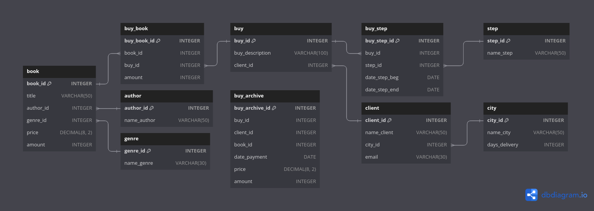

- [Структура базы данных используемая в примерах](#1)

<!-- @@@@@@@@@@@@@@@@@@@@@@@@@@@@@@@@@@@@@@@@@@@@@@@@@@@@@@@@@@@@@@@@@@@@@@ -->

---

<h3 id="1" align="center">Структура базы данных используемая в примерах</h3>

<p align="center"></p>

<details><br><summary>Описание таблиц</summary>

<details><br><summary>book</summary>

__book__ - таблица в которой хранится информация о книгах на складе.
- __book_id__ - уникальный идентификатор книги;
- __title__ - название книги;
- __author_id__ - автор книги, у каждой книги может быть только один автор
  [ON DELETE CASCADE];
- __genre_id__ - жанр книги, у каждой книги может быть только один жанр
  [ON DELETE SET NULL];
- __price__ - цена книги, в рублях;
- __amount__ - кол-во книг на складе, в штуках.

<hr style="margin-left: 25%; margin-right: 25%;"></details>

<details><br><summary>author</summary>

__author__ - таблица в которой хранится информация об авторах книг.
- __author_id__ - уникальный идентификатор автора;
- __name_author__ - фамилия и инициалы автора.

<hr style="margin-left: 25%; margin-right: 25%;"></details>

<details><br><summary>genre</summary>

__genre__ - таблица в которой хранится информация о жанрах книг.
- __genre_id__ - уникальный идентификатор жанра;
- __name_genre__ - название жанра.

<hr style="margin-left: 25%; margin-right: 25%;"></details>

<details><br><summary>buy</summary>

__buy__ - таблица в которой хранится информация о заказах.
- __buy_id__ - уникальный идентификатор заказа;
- __buy_description__ - пожелание клиента к заказу;
- __client_id__ - клиент совершивший заказ, у каждого заказа может быть только
  один клиент [ON DELETE CASCADE].

<hr style="margin-left: 25%; margin-right: 25%;"></details>

<details><br><summary>client</summary>

__client__ - таблица в которой хранится информация о пользователях.
- __client_id__ - уникальный идентификатор пользователя;
- __name_client__ - фамилия и имя пользователя;
- __city_id__ - город пользователя, у каждого пользователя может быть только
  один город [ON DELETE CASCADE];
- __email__ - электронная почта пользователя.

<hr style="margin-left: 25%; margin-right: 25%;"></details>

<details><br><summary>step</summary>

__step__ - таблица в которой хранятся возможные статусы заказа.
- __step_id__ - уникальный идентификатор статуса заказа;
- __name_step__ - название статуса.

<hr style="margin-left: 25%; margin-right: 25%;"></details>

<details><br><summary>city</summary>

__city__ - таблица в которой хранится информация о городах.
- __city_id__ - уникальный идентификатор статуса города;
- __name_city__ - название города;
- __days_delivery__ - средний срок доставки заказа в этом городе, в днях.

<hr style="margin-left: 25%; margin-right: 25%;"></details>

<details><br><summary>buy_book</summary>

__buy_book__ - промежуточная таблица для связи заказа(buy) с книгой(book).
- __buy_book_id__ - уникальный идентификатор;
- __book_id__ - заказанная книга, каждая книга может присутствовать во многих
  заказах [ON DELETE CASCADE];
- __buy_id__ - объект заказа, в одном заказе может быть заказано много разных
  книг [ON DELETE CASCADE];
- __amount__ - кол-во заказанных экземпляров книги, в штуках.

<hr style="margin-left: 25%; margin-right: 25%;"></details>

<details><br><summary>buy_step</summary>

__buy_step__ - промежуточная таблица для связи статуса заказа(step) с заказом
(buy).
- __buy_step_id__ - уникальный идентификатор;
- __buy_id__ - объект заказа, для каждого заказа может быть много статусов
  [ON DELETE CASCADE] (в таблице хранится история статусов заказа);
- __step_id__ - статус, один статус может быть назначен многим заказам
  [ON DELETE CASCADE];
- __date_step_beg__ - дата присвоения статуса(step_id) к заказу(buy_id);
- __date_step_end__ - дата когда заказ(buy_id) перестал соответствовать статусу
  (step_id).

<hr style="margin-left: 25%; margin-right: 25%;"></details>

<details><br><summary>buy_archive</summary>

__buy_archive__ - таблица в которой хранится история продаж.
- __buy_archive_id__ - уникальный идентификатор;
- __buy_id__ - идентификатор заказа на момент создания таблицы;
- __client_id__ - идентификатор пользователя совершивший заказ;
- __book_id__ - идентификатор заказанной книги;
- __date_payment__ - дата когда клиент оплатил заказ;
- __price__ - стоимость одного экземпляра книги в рублях на момент заказа;
- __amount__ - кол-во заказанных пользователем экземпляров.

</details>

</details>

<!-- @@@@@@@@@@@@@@@@@@@@@@@@@@@@@@@@@@@@@@@@@@@@@@@@@@@@@@@@@@@@@@@@@@@@@@ -->

---

<h3 id="2" align="center">Запросы на основе трех и более связанных таблиц</h3>

__Пример:__

Вывести фамилии всех клиентов, которые заказали книгу Булгакова «Мастер и
Маргарита».

```sql
SELECT DISTINCT client.name_client
  FROM client
       INNER JOIN buy USING (client_id)
       INNER JOIN buy_book USING (buy_id)
       INNER JOIN book USING (book_id)
       INNER JOIN author USING (author_id)
 WHERE book.title LIKE 'мастер и маргарита'
   AND author.name_author LIKE 'булгаков %';
```
```text
name_client  |
-------------+
Баранов Павел|
Абрамова Катя|
```

<p align="center">~~~</p>

__Задача 1:__

Вывести все заказы Баранова Павла (id заказа, какие книги, по какой цене и в
каком количестве он заказал) в отсортированном по номеру заказа и названиям
книг виде.

```sql
  SELECT buy.buy_id,
         book.title,
         book.price,
         buy_book.amount
    FROM buy_book
         INNER JOIN buy USING (buy_id)
         INNER JOIN client USING (client_id)
         INNER JOIN book USING (book_id)
   WHERE client.name_client LIKE 'баранов павел'
ORDER BY buy.buy_id ASC,
         book.title ASC;
```
```text
buy_id|title             |price |amount|
------+------------------+------+------+
     1|Идиот             |460.00|     1|
     1|Мастер и Маргарита|670.99|     1|
     1|Черный человек    |570.20|     2|
     4|Игрок             |480.50|     1|
```

<p align="center">~~~</p>

__Задача 2:__

Посчитать, сколько раз была заказана каждая книга, для книги вывести ее автора
(нужно посчитать, в каком количестве заказов фигурирует каждая книга). Вывести
фамилию и инициалы автора, название книги, последний столбец назвать Количество.
Результат отсортировать сначала  по фамилиям авторов, а потом по названиям книг.

```sql
  SELECT author.name_author,
         book.title,
         COUNT(buy_book.book_id) AS Количество
    FROM buy_book
         RIGHT JOIN book USING (book_id)
         INNER JOIN author USING (author_id)
GROUP BY author.name_author,
         book.title
ORDER BY author.name_author ASC,
         book.title ASC;
```
```text
name_author     |title                |Количество|
----------------+---------------------+----------+
Булгаков М.А.   |Белая гвардия        |         1|
Булгаков М.А.   |Мастер и Маргарита   |         2|
Достоевский Ф.М.|Братья Карамазовы    |         0|
Достоевский Ф.М.|Игрок                |         1|
Достоевский Ф.М.|Идиот                |         2|
Есенин С.А.     |Стихотворения и поэмы|         0|
Есенин С.А.     |Черный человек       |         1|
Пастернак Б.Л.  |Лирика               |         1|
```

<p align="center">~~~</p>

__Задача 3:__

Вывести города, в которых живут клиенты, оформлявшие заказы в интернет-магазине.
Указать количество заказов в каждом городе, этот столбец назвать Количество.
Информацию вывести по убыванию количества заказов, а затем в алфавитном порядке
по названию городов.

```sql
SELECT city.name_city,
       COUNT(city.name_city) AS Количество
  FROM city
       INNER JOIN client USING (city_id)
       INNER JOIN buy USING (client_id)
GROUP BY city.name_city
ORDER BY Количество DESC,
         city.name_city ASC;
```
```text
name_city      |Количество|
---------------+----------+
Владивосток    |         2|
Москва         |         1|
Санкт-Петербург|         1|
```

<p align="center">~~~</p>

__Задача 4:__

Вывести номера всех оплаченных заказов и даты, когда они были оплачены.

```sql
SELECT buy_step.buy_id,
       buy_step.date_step_end
  FROM buy_step
       INNER JOIN step USING (step_id)
 WHERE step.name_step LIKE 'оплата'
   AND NOT ISNULL(buy_step.date_step_end);
```
```text
buy_id|date_step_end|
------+-------------+
     1|   2020-02-20|
     2|   2020-02-28|
     3|   2020-03-05|
```

<p align="center">~~~</p>

__Задача 5:__

Вывести информацию о каждом заказе: его номер, кто его сформировал (фамилия
пользователя) и его стоимость (сумма произведений количества заказанных книг и
их цены), в отсортированном по номеру заказа виде. Последний столбец назвать
Стоимость.

```sql
  SELECT buy_book.buy_id,
         client.name_client,
         SUM(book.price * buy_book.amount) AS Стоимость
    FROM buy_book
         INNER JOIN buy USING (buy_id)
         INNER JOIN client USING (client_id)
         INNER JOIN book USING (book_id)
GROUP BY buy_book.buy_id
ORDER BY buy_book.buy_id ASC;
```
```text
buy_id|name_client   |Стоимость|
------+--------------+---------+
     1|Баранов Павел |  2271.39|
     2|Семенонов Иван|  1037.98|
     3|Абрамова Катя |  2131.49|
     4|Баранов Павел |   480.50|
```

<p align="center">~~~</p>

__Задача 6:__

Вывести номера заказов (buy_id) и названия этапов, на которых они в данный
момент находятся. Если заказ доставлен –  информацию о нем не выводить.
Информацию отсортировать по возрастанию buy_id.

```sql
  SELECT buy_step.buy_id,
         step.name_step
    FROM buy_step
         INNER JOIN step USING (step_id)
   WHERE ISNULL(buy_step.date_step_end)
     AND NOT ISNULL(buy_step.date_step_beg)
ORDER BY buy_step.buy_id ASC;
```
```text
buy_id|name_step      |
------+---------------+
     2|Транспортировка|
     3|Доставка       |
     4|Оплата         |
```

<p align="center">~~~</p>

__Задача 7:__

В таблице city для каждого города указано количество дней, за которые заказ
может быть доставлен в этот город (рассматривается только этап Транспортировка).

Для тех заказов, которые прошли этап транспортировки, вывести количество дней
за которое заказ реально доставлен в город. А также, если заказ доставлен с
опозданием, указать количество дней задержки, в противном случае вывести 0. В
результат включить номер заказа (buy_id), а также вычисляемые столбцы
Количество_дней и Опоздание. Информацию вывести в отсортированном по номеру
заказа виде.

```sql
  SELECT buy.buy_id,
         @diff := DATEDIFF(buy_step.date_step_end, buy_step.date_step_beg) AS Количество_дней,
         IF(@diff > @norm := city.days_delivery, @diff - @norm, 0) AS Опоздание
    FROM buy
         INNER JOIN buy_step USING (buy_id)
         INNER JOIN step USING (step_id)
         INNER JOIN client USING (client_id)
         INNER JOIN city USING (city_id)
   WHERE step.name_step LIKE 'транспортировка'
     AND NOT ISNULL(buy_step.date_step_end)
ORDER BY buy.buy_id ASC;
```
```text
buy_id|Количество_дней|Опоздание|
------+---------------+---------+
     1|             14|        2|
     3|              5|        0|
```

<p align="center">~~~</p>

__Задача 8:__

Выбрать всех клиентов, которые заказывали книги Достоевского, информацию
вывести в отсортированном по алфавиту виде. В решении используйте фамилию
автора, а не его id.

```sql
  SELECT DISTINCT client.name_client
    FROM client
         INNER JOIN buy USING (client_id)
         INNER JOIN buy_book USING (buy_id)
         INNER JOIN book USING (book_id)
         INNER JOIN author USING (author_id)
   WHERE author.name_author LIKE 'достоевский%'
ORDER BY client.name_client ASC;
```
```text
name_client  |
-------------+
Абрамова Катя|
Баранов Павел|
```

<p align="center">~~~</p>

__Задача 9:__

Вывести жанр (или жанры), в котором было заказано больше всего экземпляров книг,
указать это количество. Последний столбец назвать Количество.

```sql
  SELECT genre.name_genre,
         SUM(buy_book.amount) AS Количество
    FROM genre
         INNER JOIN book USING (genre_id)
         INNER JOIN buy_book USING (book_id)
GROUP BY book.genre_id
  HAVING SUM(buy_book.amount) = (  SELECT SUM(buy_book.amount)
                                     FROM buy_book
                                          INNER JOIN book USING (book_id)
                                 GROUP BY book.genre_id
                                    LIMIT 1);
```
```text
name_genre|Количество|
----------+----------+
Роман     |         7|
```

<p align="center">~~~</p>

__Задача 10:__

Сравнить ежемесячную выручку от продажи книг за текущий и предыдущий годы. Для
этого вывести год, месяц, сумму выручки в отсортированном сначала по
возрастанию месяцев, затем по возрастанию лет виде. Название столбцов: Год,
Месяц, Сумма.

<details><br><summary>Таблица продаж за прошлый год buy_archive</summary>

```text
buy_archive_id|buy_id|client_id|book_id|date_payment|price |amount|
--------------+------+---------+-------+------------+------+------+
             1|     2|        1|      1|  2019-02-21|670.60|     2|
             2|     2|        1|      3|  2019-02-21|450.90|     1|
             3|     1|        2|      2|  2019-02-10|520.30|     2|
             4|     1|        2|      4|  2019-02-10|780.90|     3|
             5|     1|        2|      3|  2019-02-10|450.90|     1|
             6|     3|        4|      4|  2019-03-05|780.90|     4|
             7|     3|        4|      5|  2019-03-05|480.90|     2|
             8|     4|        1|      6|  2019-03-12|650.00|     1|
             9|     5|        2|      1|  2019-03-18|670.60|     2|
            10|     5|        2|      4|  2019-03-18|780.90|     1|
```

<hr style="margin-left: 25%; margin-right: 25%;"></details><br>

```sql
  SELECT YEAR(buy_archive.date_payment) AS Год,
         MONTHNAME(buy_archive.date_payment) AS Месяц,
         SUM(buy_archive.price * buy_archive.amount) AS Сумма
    FROM buy_archive
GROUP BY YEAR(date_payment),
         MONTHNAME(date_payment)
   UNION
  SELECT YEAR(buy_step.date_step_end) AS Год,
         MONTHNAME(buy_step.date_step_end) AS Месяц,
         SUM(book.price * buy_book.amount) AS Сумма
    FROM step
         INNER JOIN buy_step USING (step_id)
         INNER JOIN buy_book USING (buy_id)
         INNER JOIN book USING (book_id)
   WHERE step.name_step LIKE 'оплата'
     AND NOT ISNULL(buy_step.date_step_end)
GROUP BY YEAR(buy_step.date_step_end),
         MONTHNAME(buy_step.date_step_end)
-- Логичнее делать сортировку по числу месяца нежели по его названию.
ORDER BY MONTH(STR_TO_DATE(CONCAT(Месяц, '-01-2000'), '%M-%d-%Y')) ASC,
         Год ASC;
```
```text
Год |Месяц   |Сумма  |
----+--------+-------+
2019|February|5626.30|
2020|February|3309.37|
2019|March   |6857.50|
2020|March   |2131.49|
```

<p align="center">~~~</p>

__Задача 11:__

Для каждой отдельной книги необходимо вывести информацию о количестве проданных
экземпляров и их стоимости за 2020 и 2019 год . Вычисляемые столбцы назвать
Количество и Сумма. Информацию отсортировать по убыванию стоимости.

<details><br><summary>Под-запросы</summary>

```sql
   SELECT book.title AS title,
          book.author_id AS author_id,
          SUM(buy_archive.amount) AS Количество,
          SUM(buy_archive.price * buy_archive.amount) AS Сумма
     FROM buy_archive
          INNER JOIN book USING (book_id)
 GROUP BY book.title,
          book.author_id;
```
```text
title                |author_id|Количество|Сумма  |
---------------------+---------+----------+-------+
Мастер и Маргарита   |        1|         4|2682.40|
Идиот                |        2|         2| 901.80|
Белая гвардия        |        1|         2|1040.60|
Братья Карамазовы    |        2|         8|6247.20|
Игрок                |        2|         2| 961.80|
Стихотворения и поэмы|        3|         1| 650.00|
```

<p align="center">~~~</p>

```sql
  SELECT book.title AS title,
         book.author_id AS author_id,
         SUM(buy_book.amount) AS Количество,
         SUM(buy_book.amount * book.price) AS Сумма
    FROM buy_book
         INNER JOIN book USING (book_id)
         INNER JOIN buy_step USING (buy_id)
         INNER JOIN step USING (step_id)
   WHERE step.name_step LIKE 'оплата'
     AND NOT ISNULL(buy_step.date_step_end)
GROUP BY book.title,
         book.author_id;
```
```text
title             |author_id|Количество|Сумма  |
------------------+---------+----------+-------+
Мастер и Маргарита|        1|         2|1341.98|
Черный человек    |        3|         2|1140.40|
Идиот             |        2|         3|1380.00|
Лирика            |        4|         2|1037.98|
Белая гвардия     |        1|         1| 540.50|
```

<p align="center">~~~</p>

```sql
   SELECT book.title AS title,
          book.author_id AS author_id,
          SUM(buy_archive.amount) AS Количество,
          SUM(buy_archive.price * buy_archive.amount) AS Сумма
     FROM buy_archive
          INNER JOIN book USING (book_id)
 GROUP BY book.title,
          book.author_id
UNION ALL
   SELECT book.title AS title,
          book.author_id AS author_id,
          SUM(buy_book.amount) AS Количество,
          SUM(buy_book.amount * book.price) AS Сумма
     FROM buy_book
          INNER JOIN book USING (book_id)
          INNER JOIN buy_step USING (buy_id)
          INNER JOIN step USING (step_id)
    WHERE step.name_step LIKE 'оплата'
      AND NOT ISNULL(buy_step.date_step_end)
 GROUP BY book.title,
          book.author_id;
```
```text
title                |author_id|Количество|Сумма  |
---------------------+---------+----------+-------+
Мастер и Маргарита   |        1|         4|2682.40|
Идиот                |        2|         2| 901.80|
Белая гвардия        |        1|         2|1040.60|
Братья Карамазовы    |        2|         8|6247.20|
Игрок                |        2|         2| 961.80|
Стихотворения и поэмы|        3|         1| 650.00|
Мастер и Маргарита   |        1|         2|1341.98|
Черный человек       |        3|         2|1140.40|
Идиот                |        2|         3|1380.00|
Лирика               |        4|         2|1037.98|
Белая гвардия        |        1|         1| 540.50|
```

<hr style="margin-left: 25%; margin-right: 25%;"></details><br>

```sql
  SELECT temp.title,
         SUM(temp.Количество) AS Количество,
         SUM(temp.Сумма) AS Сумма
    FROM (   SELECT book.title AS title,
                    book.author_id AS author_id,
                    SUM(buy_archive.amount) AS Количество,
                    SUM(buy_archive.price * buy_archive.amount) AS Сумма
               FROM buy_archive
                    INNER JOIN book USING (book_id)
           GROUP BY book.title,
                    book.author_id
          UNION ALL
             SELECT book.title AS title,
                    book.author_id AS author_id,
                    SUM(buy_book.amount) AS Количество,
                    SUM(buy_book.amount * book.price) AS Сумма
               FROM buy_book
                    INNER JOIN book USING (book_id)
                    INNER JOIN buy_step USING (buy_id)
                    INNER JOIN step USING (step_id)
              WHERE step.name_step LIKE 'оплата'
                AND NOT ISNULL(buy_step.date_step_end)
           GROUP BY book.title,
                    book.author_id) AS temp
GROUP BY temp.title,
         temp.author_id
ORDER BY Сумма DESC;
```
```text
title                |Количество|Сумма  |
---------------------+----------+-------+
Братья Карамазовы    |         8|6247.20|
Мастер и Маргарита   |         6|4024.38|
Идиот                |         5|2281.80|
Белая гвардия        |         3|1581.10|
Черный человек       |         2|1140.40|
Лирика               |         2|1037.98|
Игрок                |         2| 961.80|
Стихотворения и поэмы|         1| 650.00|
```