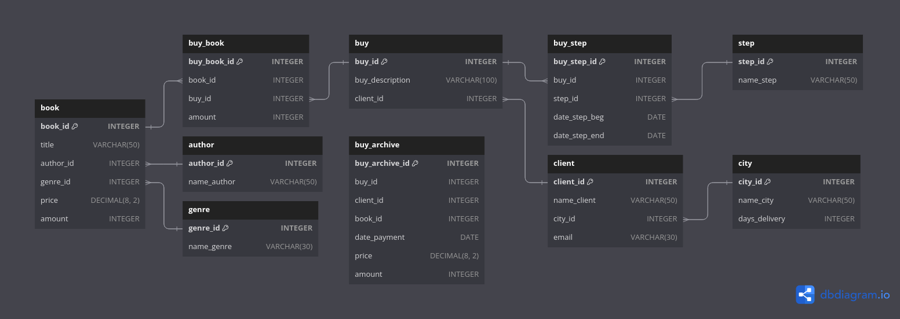

- [Структура базы данных используемая в примерах](#1)

<!-- @@@@@@@@@@@@@@@@@@@@@@@@@@@@@@@@@@@@@@@@@@@@@@@@@@@@@@@@@@@@@@@@@@@@@@ -->

---

<h3 id="1" align="center">Структура базы данных используемая в примерах</h3>

<p align="center"></p>

<details><br><summary>Описание таблиц</summary>

<details><br><summary>book</summary>

__book__ - таблица в которой хранится информация о книгах на складе.
- __book_id__ - уникальный идентификатор книги;
- __title__ - название книги;
- __author_id__ - автор книги, у каждой книги может быть только один автор
  [ON DELETE CASCADE];
- __genre_id__ - жанр книги, у каждой книги может быть только один жанр
  [ON DELETE SET NULL];
- __price__ - цена книги, в рублях;
- __amount__ - кол-во книг на складе, в штуках.

<hr style="margin-left: 25%; margin-right: 25%;"></details>

<details><br><summary>author</summary>

__author__ - таблица в которой хранится информация об авторах книг.
- __author_id__ - уникальный идентификатор автора;
- __name_author__ - фамилия и инициалы автора.

<hr style="margin-left: 25%; margin-right: 25%;"></details>

<details><br><summary>genre</summary>

__genre__ - таблица в которой хранится информация о жанрах книг.
- __genre_id__ - уникальный идентификатор жанра;
- __name_genre__ - название жанра.

<hr style="margin-left: 25%; margin-right: 25%;"></details>

<details><br><summary>buy</summary>

__buy__ - таблица в которой хранится информация о заказах.
- __buy_id__ - уникальный идентификатор заказа;
- __buy_description__ - пожелание клиента к заказу;
- __client_id__ - клиент совершивший заказ, у каждого заказа может быть только
  один клиент [ON DELETE CASCADE].

<hr style="margin-left: 25%; margin-right: 25%;"></details>

<details><br><summary>client</summary>

__client__ - таблица в которой хранится информация о пользователях.
- __client_id__ - уникальный идентификатор пользователя;
- __name_client__ - фамилия и имя пользователя;
- __city_id__ - город пользователя, у каждого пользователя может быть только
  один город [ON DELETE CASCADE];
- __email__ - электронная почта пользователя.

<hr style="margin-left: 25%; margin-right: 25%;"></details>

<details><br><summary>step</summary>

__step__ - таблица в которой хранятся возможные статусы заказа.
- __step_id__ - уникальный идентификатор статуса заказа;
- __name_step__ - название статуса.

<hr style="margin-left: 25%; margin-right: 25%;"></details>

<details><br><summary>city</summary>

__city__ - таблица в которой хранится информация о городах.
- __city_id__ - уникальный идентификатор статуса города;
- __name_city__ - название города;
- __days_delivery__ - средний срок доставки заказа в этом городе, в днях.

<hr style="margin-left: 25%; margin-right: 25%;"></details>

<details><br><summary>buy_book</summary>

__buy_book__ - промежуточная таблица для связи заказа(buy) с книгой(book).
- __buy_book_id__ - уникальный идентификатор;
- __book_id__ - заказанная книга, каждая книга может присутствовать во многих
  заказах [ON DELETE CASCADE];
- __buy_id__ - объект заказа, в одном заказе может быть заказано много разных
  книг [ON DELETE CASCADE];
- __amount__ - кол-во заказанных экземпляров книги, в штуках.

<hr style="margin-left: 25%; margin-right: 25%;"></details>

<details><br><summary>buy_step</summary>

__buy_step__ - промежуточная таблица для связи статуса заказа(step) с заказом
(buy).
- __buy_step_id__ - уникальный идентификатор;
- __buy_id__ - объект заказа, для каждого заказа может быть много статусов
  [ON DELETE CASCADE] (в таблице хранится история статусов заказа);
- __step_id__ - статус, один статус может быть назначен многим заказам
  [ON DELETE CASCADE];
- __date_step_beg__ - дата присвоения статуса(step_id) к заказу(buy_id);
- __date_step_end__ - дата когда заказ(buy_id) перестал соответствовать статусу
  (step_id).

<hr style="margin-left: 25%; margin-right: 25%;"></details>

<details><br><summary>buy_archive</summary>

__buy_archive__ - таблица в которой хранится история продаж.
- __buy_archive_id__ - уникальный идентификатор;
- __buy_id__ - идентификатор заказа на момент создания таблицы;
- __client_id__ - идентификатор пользователя совершивший заказ;
- __book_id__ - идентификатор заказанной книги;
- __date_payment__ - дата когда клиент оплатил заказ;
- __price__ - стоимость одного экземпляра книги в рублях на момент заказа;
- __amount__ - кол-во заказанных пользователем экземпляров.

</details>

</details>

<!-- @@@@@@@@@@@@@@@@@@@@@@@@@@@@@@@@@@@@@@@@@@@@@@@@@@@@@@@@@@@@@@@@@@@@@@ -->

---

__Задача 1:__

Включить нового человека в таблицу с клиентами. Его имя Попов Илья, его email
popov@test, проживает он в Москве.

<details><br><summary>Таблицы client и city до</summary>

```text
client_id|name_client    |city_id|email         |
---------+---------------+-------+--------------+
        1|Баранов Павел  |      3|baranov@test  |
        2|Абрамова Катя  |      1|abramova@test |
        3|Семенонов Иван |      2|semenov@test  |
        4|Яковлева Галина|      1|yakovleva@test|
```
```text
city_id|name_city      |days_delivery|
-------+---------------+-------------+
      1|Москва         |            5|
      2|Санкт-Петербург|            3|
      3|Владивосток    |           12|
```

<hr style="margin-left: 25%; margin-right: 25%;"></details><br>

```sql
INSERT INTO client(name_client, email, city_id)
     SELECT 'Попов Илья',
            'popov@test',
            city_id
       FROM city
      WHERE name_city LIKE 'москва';
```

<details><br><summary>Таблицы client и city после</summary>

```text
client_id|name_client    |city_id|email         |
---------+---------------+-------+--------------+
        1|Баранов Павел  |      3|baranov@test  |
        2|Абрамова Катя  |      1|abramova@test |
        3|Семенонов Иван |      2|semenov@test  |
        4|Яковлева Галина|      1|yakovleva@test|
        5|Попов Илья     |      1|popov@test    | <-+
```
```text
city_id|name_city      |days_delivery|
-------+---------------+-------------+
      1|Москва         |            5|
      2|Санкт-Петербург|            3|
      3|Владивосток    |           12|
```

</details>

---

__Задача 2:__

Создать новый заказ для Попова Ильи. Его комментарий для заказа: «Связаться со
мной по вопросу доставки». __Важно!__ В решении нельзя использоваться VALUES.

<details><br><summary>Таблицы buy и client до</summary>

```text
buy_id|buy_description                      |client_id|
------+-------------------------------------+---------+
     1|Доставка только вечером              |        1|
     2|                                     |        3|
     3|Упаковать каждую книгу по отдельности|        2|
     4|                                     |        1|
```
```text
client_id|name_client    |city_id|email         |
---------+---------------+-------+--------------+
        1|Баранов Павел  |      3|baranov@test  |
        2|Абрамова Катя  |      1|abramova@test |
        3|Семенонов Иван |      2|semenov@test  |
        4|Яковлева Галина|      1|yakovleva@test|
        5|Попов Илья     |      1|popov@test    |
```

<hr style="margin-left: 25%; margin-right: 25%;"></details><br>

```sql
INSERT INTO buy(buy_description, client_id)
     SELECT 'Связаться со мной по вопросу доставки',
            client_id
       FROM client
      WHERE name_client LIKE 'попов илья';
```

<details><br><summary>Таблицы buy и client после</summary>

```text
buy_id|buy_description                      |client_id|
------+-------------------------------------+---------+
     1|Доставка только вечером              |        1|
     2|                                     |        3|
     3|Упаковать каждую книгу по отдельности|        2|
     4|                                     |        1|
     5|Связаться со мной по вопросу доставки|        5| <-+
```
```text
client_id|name_client    |city_id|email         |
---------+---------------+-------+--------------+
        1|Баранов Павел  |      3|baranov@test  |
        2|Абрамова Катя  |      1|abramova@test |
        3|Семенонов Иван |      2|semenov@test  |
        4|Яковлева Галина|      1|yakovleva@test|
        5|Попов Илья     |      1|popov@test    |
```

</details>

---

__Задача 3:__

В таблицу buy_book добавить заказ с номером 5. Этот заказ должен содержать
книгу Пастернака «Лирика» в количестве двух экземпляров и книгу Булгакова
«Белая гвардия» в одном экземпляре.

<details><br><summary>Таблицы buy, book и author</summary>

<p align="center">buy</p>

```text
buy_id|buy_description                      |client_id|
------+-------------------------------------+---------+
     1|Доставка только вечером              |        1|
     2|                                     |        3|
     3|Упаковать каждую книгу по отдельности|        2|
     4|                                     |        1|
     5|Связаться со мной по вопросу доставки|        5| <-
```

<p align="center">book</p>

```text
book_id|title                |author_id|genre_id|price |amount|
-------+---------------------+---------+--------+------+------+
      1|Мастер и Маргарита   |        1|       1|670.99|     3|
      2|Белая гвардия        |        1|       1|540.50|     5| <-1
      3|Идиот                |        2|       1|460.00|    10|
      4|Братья Карамазовы    |        2|       1|799.01|     3|
      5|Игрок                |        2|       1|480.50|    10|
      6|Стихотворения и поэмы|        3|       2|650.00|    15|
      7|Черный человек       |        3|       2|570.20|     6|
      8|Лирика               |        4|       2|518.99|     2| <-2
```

<p align="center">author</p>

```text
author_id|name_author     |
---------+----------------+
        1|Булгаков М.А.   | <-
        2|Достоевский Ф.М.|
        3|Есенин С.А.     |
        4|Пастернак Б.Л.  | <-
        5|Лермонтов М.Ю.  |
```

<hr style="margin-left: 25%; margin-right: 25%;"></details>

<details><br><summary>Таблица buy_book до</summary>

```text
buy_book_id|buy_id|book_id|amount|
-----------+------+-------+------+
          1|     1|      1|     1|
          2|     1|      7|     2|
          3|     1|      3|     1|
          4|     2|      8|     2|
          5|     3|      3|     2|
          6|     3|      2|     1|
          7|     3|      1|     1|
          8|     4|      5|     1|
```

<hr style="margin-left: 25%; margin-right: 25%;"></details><br>

```sql
INSERT INTO buy_book(buy_id, amount, book_id)
       SELECT 5,
              2,
              book_id
         FROM book
              INNER JOIN author
                      ON book.author_id = author.author_id
                     AND author.name_author LIKE 'пастернак%'
        WHERE book.title LIKE 'лирика'
    UNION ALL
       SELECT 5,
              1,
              book_id
         FROM book
              INNER JOIN author
                      ON book.author_id = author.author_id
                     AND author.name_author LIKE 'булгаков%'
        WHERE book.title LIKE 'белая гвардия';
```

<details><br><summary>Таблица buy_book после</summary>

```text
buy_book_id|buy_id|book_id|amount|
-----------+------+-------+------+
          1|     1|      1|     1|
          2|     1|      7|     2|
          3|     1|      3|     1|
          4|     2|      8|     2|
          5|     3|      3|     2|
          6|     3|      2|     1|
          7|     3|      1|     1|
          8|     4|      5|     1|
          9|     5|      8|     2| <-+
         10|     5|      2|     1| <-+
```

</details>

---

__Задача 4:__

Количество тех книг на складе, которые были включены в заказ с номером 5,
уменьшить на то количество, которое в заказе с номером 5  указано.

<details><br><summary>Таблица buy_book</summary>

```text
buy_book_id|buy_id|book_id|amount|
-----------+------+-------+------+
          1|     1|      1|     1|
          2|     1|      7|     2|
          3|     1|      3|     1|
          4|     2|      8|     2|
          5|     3|      3|     2|
          6|     3|      2|     1|
          7|     3|      1|     1|
          8|     4|      5|     1|
          9|     5|      8|     2| <-
         10|     5|      2|     1| <-
```

<hr style="margin-left: 25%; margin-right: 25%;"></details>

<details><br><summary>Таблица book до</summary>

```text
book_id|title                |author_id|genre_id|price |amount|
-------+---------------------+---------+--------+------+------+
      1|Мастер и Маргарита   |        1|       1|670.99|     3|
      2|Белая гвардия        |        1|       1|540.50|     5| <- -1
      3|Идиот                |        2|       1|460.00|    10|
      4|Братья Карамазовы    |        2|       1|799.01|     3|
      5|Игрок                |        2|       1|480.50|    10|
      6|Стихотворения и поэмы|        3|       2|650.00|    15|
      7|Черный человек       |        3|       2|570.20|     6|
      8|Лирика               |        4|       2|518.99|     2| <- -2
```

<hr style="margin-left: 25%; margin-right: 25%;"></details><br>

```sql
UPDATE book
       INNER JOIN buy_book
               ON book.book_id = buy_book.book_id
              AND buy_book.buy_id = 5
   SET book.amount = book.amount - buy_book.amount;
```

<details><br><summary>Таблица book после</summary>

```text
book_id|title                |author_id|genre_id|price |amount|
-------+---------------------+---------+--------+------+------+
      1|Мастер и Маргарита   |        1|       1|670.99|     3|
      2|Белая гвардия        |        1|       1|540.50|     4| <- -1
      3|Идиот                |        2|       1|460.00|    10|
      4|Братья Карамазовы    |        2|       1|799.01|     3|
      5|Игрок                |        2|       1|480.50|    10|
      6|Стихотворения и поэмы|        3|       2|650.00|    15|
      7|Черный человек       |        3|       2|570.20|     6|
      8|Лирика               |        4|       2|518.99|     0| <- -2
```

</details>

---

__Задача 5:__

Создать счет (таблицу buy_pay) на оплату заказа с номером 5, в который включить
название книг, их автора, цену, количество заказанных книг и  стоимость.
Последний столбец назвать Стоимость. Информацию в таблицу занести в
отсортированном по названиям книг виде.

<details><br><summary>Таблицы buy_book, book и author</summary>

<p align="center">buy_book</p>

```text
buy_book_id|buy_id|book_id|amount|
-----------+------+-------+------+
          1|     1|      1|     1|
          2|     1|      7|     2|
          3|     1|      3|     1|
          4|     2|      8|     2|
          5|     3|      3|     2|
          6|     3|      2|     1|
          7|     3|      1|     1|
          8|     4|      5|     1|
          9|     5|      8|     2| <-
         10|     5|      2|     1| <-
```

<p align="center">book</p>

```text
book_id|title                |author_id|genre_id|price |amount|
-------+---------------------+---------+--------+------+------+
      1|Мастер и Маргарита   |        1|       1|670.99|     3|
      2|Белая гвардия        |        1|       1|540.50|     4| <-
      3|Идиот                |        2|       1|460.00|    10|
      4|Братья Карамазовы    |        2|       1|799.01|     3|
      5|Игрок                |        2|       1|480.50|    10|
      6|Стихотворения и поэмы|        3|       2|650.00|    15|
      7|Черный человек       |        3|       2|570.20|     6|
      8|Лирика               |        4|       2|518.99|     0| <-
```

<p align="center">author</p>

```text
author_id|name_author     |
---------+----------------+
        1|Булгаков М.А.   | <-
        2|Достоевский Ф.М.|
        3|Есенин С.А.     |
        4|Пастернак Б.Л.  |
        5|Лермонтов М.Ю.  | <-
```

<hr style="margin-left: 25%; margin-right: 25%;"></details><br>

```sql
CREATE TABLE buy_pay
      SELECT book.title,
             author.name_author,
             book.price,
             buy_book.amount,
             buy_book.amount * book.price AS Стоимость
        FROM book
             INNER JOIN buy_book
                     ON book.book_id = buy_book.book_id
                    AND buy_book.buy_id = 5
             INNER JOIN author USING (author_id)
    ORDER BY book.title ASC;
```
```text
title        |name_author   |price |amount|Стоимость|
-------------+--------------+------+------+---------+
Белая гвардия|Булгаков М.А. |540.50|     1|   540.50|
Лирика       |Пастернак Б.Л.|518.99|     2|  1037.98|
```

---

__Задача 6:__

Создать общий счет (таблицу buy_pay) на оплату заказа с номером 5. Куда
включить номер заказа, количество книг в заказе (название столбца Количество) и
его общую стоимость (название столбца Итого). Для решения используйте ОДИН
запрос.

<details><br><summary>Таблицы buy_book и book</summary>

<p align="center">buy_book</p>

```text
buy_book_id|buy_id|book_id|amount|
-----------+------+-------+------+
          1|     1|      1|     1|
          2|     1|      7|     2|
          3|     1|      3|     1|
          4|     2|      8|     2|
          5|     3|      3|     2|
          6|     3|      2|     1|
          7|     3|      1|     1|
          8|     4|      5|     1|
          9|     5|      8|     2| <-
         10|     5|      2|     1| <-
```

<p align="center">book</p>

```text
book_id|title                |author_id|genre_id|price |amount|
-------+---------------------+---------+--------+------+------+
      1|Мастер и Маргарита   |        1|       1|670.99|     3|
      2|Белая гвардия        |        1|       1|540.50|     4| <-
      3|Идиот                |        2|       1|460.00|    10|
      4|Братья Карамазовы    |        2|       1|799.01|     3|
      5|Игрок                |        2|       1|480.50|    10|
      6|Стихотворения и поэмы|        3|       2|650.00|    15|
      7|Черный человек       |        3|       2|570.20|     6|
      8|Лирика               |        4|       2|518.99|     0| <-
```

<hr style="margin-left: 25%; margin-right: 25%;"></details><br>

```sql
CREATE TABLE buy_pay
      SELECT buy_book.buy_id,
             SUM(buy_book.amount) AS Количество,
             SUM(book.price * buy_book.amount) AS Итого
        FROM book
             INNER JOIN buy_book
                     ON book.book_id = buy_book.book_id
                    AND buy_book.buy_id = 5
    GROUP BY buy_book.buy_id;
```
```text
buy_id|Количество|Итого  |
------+----------+-------+
     5|         3|1578.48|
```

---

__Задача 7:__

В таблицу buy_step для заказа с номером 5 включить все этапы из таблицы step,
которые должен пройти этот заказ. В столбцы date_step_beg и date_step_end всех
записей занести NULL.

<details><br><summary>Таблица step</summary>

```text
step_id|name_step      |
-------+---------------+
      1|Оплата         |
      2|Упаковка       |
      3|Транспортировка|
      4|Доставка       |
```

<hr style="margin-left: 25%; margin-right: 25%;"></details>

<details><br><summary>Таблица buy_step до</summary>

```text
buy_step_id|buy_id|step_id|date_step_beg|date_step_end|
-----------+------+-------+-------------+-------------+
          1|     1|      1|   2020-02-20|   2020-02-20|
          2|     1|      2|   2020-02-20|   2020-02-21|
          3|     1|      3|   2020-02-22|   2020-03-07|
          4|     1|      4|   2020-03-08|   2020-03-08|
          5|     2|      1|   2020-02-28|   2020-02-28|
          6|     2|      2|   2020-02-29|   2020-03-01|
          7|     2|      3|   2020-03-02|             |
          8|     2|      4|             |             |
          9|     3|      1|   2020-03-05|   2020-03-05|
         10|     3|      2|   2020-03-05|   2020-03-06|
         11|     3|      3|   2020-03-06|   2020-03-11|
         12|     3|      4|   2020-03-12|             |
         13|     4|      1|   2020-03-20|             |
         14|     4|      2|             |             |
         15|     4|      3|             |             |
         16|     4|      4|             |             |
```

<hr style="margin-left: 25%; margin-right: 25%;"></details><br>

```sql
INSERT INTO buy_step(buy_id, step_id, date_step_beg, date_step_end)
     SELECT 5,
            step_id,
            NULL,
            NULL
       FROM step
   ORDER BY step_id ASC;
```

<details><br><summary>Таблица buy_step после</summary>

```text
buy_step_id|buy_id|step_id|date_step_beg|date_step_end|
-----------+------+-------+-------------+-------------+
          1|     1|      1|   2020-02-20|   2020-02-20|
          2|     1|      2|   2020-02-20|   2020-02-21|
          3|     1|      3|   2020-02-22|   2020-03-07|
          4|     1|      4|   2020-03-08|   2020-03-08|
          5|     2|      1|   2020-02-28|   2020-02-28|
          6|     2|      2|   2020-02-29|   2020-03-01|
          7|     2|      3|   2020-03-02|             |
          8|     2|      4|             |             |
          9|     3|      1|   2020-03-05|   2020-03-05|
         10|     3|      2|   2020-03-05|   2020-03-06|
         11|     3|      3|   2020-03-06|   2020-03-11|
         12|     3|      4|   2020-03-12|             |
         13|     4|      1|   2020-03-20|             |
         14|     4|      2|             |             |
         15|     4|      3|             |             |
         16|     4|      4|             |             |
         17|     5|      1|             |             | <-+
         18|     5|      2|             |             | <-+
         19|     5|      3|             |             | <-+
         20|     5|      4|             |             | <-+
```

</details>

---

__Задача 8:__

В таблицу buy_step занести дату 12.04.2020 выставления счета на оплату заказа с
номером 5. Правильнее было бы занести не конкретную, а текущую дату. Это можно
сделать с помощью функции NOW(). Но при этом в разные дни будут вставляться
разная дата, и задание нельзя будет проверить, поэтому вставим дату 12.04.2020.

<details><br><summary>Таблица step</summary>

```text
step_id|name_step      |
-------+---------------+
      1|Оплата         | <-
      2|Упаковка       |
      3|Транспортировка|
      4|Доставка       |
```

<hr style="margin-left: 25%; margin-right: 25%;"></details>

<details><br><summary>Таблица buy_step до</summary>

```text
buy_step_id|buy_id|step_id|date_step_beg|date_step_end|
-----------+------+-------+-------------+-------------+
          1|     1|      1|   2020-02-20|   2020-02-20|
          2|     1|      2|   2020-02-20|   2020-02-21|
          3|     1|      3|   2020-02-22|   2020-03-07|
          4|     1|      4|   2020-03-08|   2020-03-08|
          5|     2|      1|   2020-02-28|   2020-02-28|
          6|     2|      2|   2020-02-29|   2020-03-01|
          7|     2|      3|   2020-03-02|             |
          8|     2|      4|             |             |
          9|     3|      1|   2020-03-05|   2020-03-05|
         10|     3|      2|   2020-03-05|   2020-03-06|
         11|     3|      3|   2020-03-06|   2020-03-11|
         12|     3|      4|   2020-03-12|             |
         13|     4|      1|   2020-03-20|             |
         14|     4|      2|             |             |
         15|     4|      3|             |             |
         16|     4|      4|             |             |
         17|     5|      1|             |             | <-
         18|     5|      2|             |             |
         19|     5|      3|             |             |
         20|     5|      4|             |             |
```

<hr style="margin-left: 25%; margin-right: 25%;"></details><br>

```sql
UPDATE buy_step
       INNER JOIN step
               ON buy_step.step_id = step.step_id
              AND step.name_step LIKE 'оплата%'
   SET date_step_beg = '2020-04-12'
 WHERE buy_step.buy_id = 5;
```

<details><br><summary>Таблица buy_step после</summary>

```text
buy_step_id|buy_id|step_id|date_step_beg|date_step_end|
-----------+------+-------+-------------+-------------+
          1|     1|      1|   2020-02-20|   2020-02-20|
          2|     1|      2|   2020-02-20|   2020-02-21|
          3|     1|      3|   2020-02-22|   2020-03-07|
          4|     1|      4|   2020-03-08|   2020-03-08|
          5|     2|      1|   2020-02-28|   2020-02-28|
          6|     2|      2|   2020-02-29|   2020-03-01|
          7|     2|      3|   2020-03-02|             |
          8|     2|      4|             |             |
          9|     3|      1|   2020-03-05|   2020-03-05|
         10|     3|      2|   2020-03-05|   2020-03-06|
         11|     3|      3|   2020-03-06|   2020-03-11|
         12|     3|      4|   2020-03-12|             |
         13|     4|      1|   2020-03-20|             |
         14|     4|      2|             |             |
         15|     4|      3|             |             |
         16|     4|      4|             |             |
         17|     5|      1|   2020-04-12|             | <-+
         18|     5|      2|             |             |
         19|     5|      3|             |             |
         20|     5|      4|             |             |
```

</details>

---

__Задача 9:__

Завершить этап «Оплата» для заказа с номером 5, вставив в столбец date_step_end
дату 13.04.2020, и начать следующий этап («Упаковка»), задав в столбце
date_step_beg для этого этапа ту же дату.

Реализовать два запроса для завершения этапа и начала следующего. Они должны
быть записаны в общем виде, чтобы его можно было применять для любых этапов,
изменив только текущий этап. Для примера пусть это будет этап «Оплата».

```sql
UPDATE buy_step
       INNER JOIN step
               ON buy_step.step_id = step.step_id
              AND IF(step.name_step LIKE 'оплата' AND buy_step.buy_id = 5, @end_for_id := step.step_id, 1)
   SET buy_step.date_step_beg = IF(ISNULL(buy_step.date_step_beg), DATE('2020-04-13'), buy_step.date_step_beg),
       buy_step.date_step_end = IF(ISNULL(buy_step.date_step_beg), buy_step.date_step_end, DATE('2020-04-13'))
 WHERE step.step_id BETWEEN @end_for_id AND @end_for_id + 1
   AND buy_step.buy_id = 5;
```
```text
buy_step_id|buy_id|step_id|date_step_beg|date_step_end|
-----------+------+-------+-------------+-------------+
          1|     1|      1|   2020-02-20|   2020-02-20|
          2|     1|      2|   2020-02-20|   2020-02-21|
          3|     1|      3|   2020-02-22|   2020-03-07|
          4|     1|      4|   2020-03-08|   2020-03-08|
          5|     2|      1|   2020-02-28|   2020-02-28|
          6|     2|      2|   2020-02-29|   2020-03-01|
          7|     2|      3|   2020-03-02|             |
          8|     2|      4|             |             |
          9|     3|      1|   2020-03-05|   2020-03-05|
         10|     3|      2|   2020-03-05|   2020-03-06|
         11|     3|      3|   2020-03-06|   2020-03-11|
         12|     3|      4|   2020-03-12|             |
         13|     4|      1|   2020-03-20|             |
         14|     4|      2|             |             |
         15|     4|      3|             |             |
         16|     4|      4|             |             |
         17|     5|      1|   2020-04-12|   2020-04-13| <-
         18|     5|      2|   2020-04-13|             | <-
         19|     5|      3|             |             |
         20|     5|      4|             |             |
```