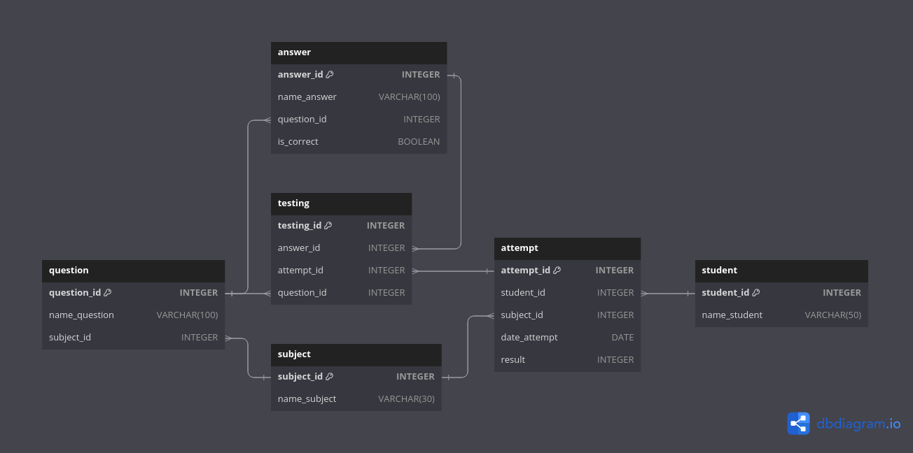

<style>@font-face{font-family:JetBrains; src:url('../00_fonts/JetBrainsMono-Light.ttf');}body{font-family:JetBrains;font-size:15px;}th{background:#1f1f1f;}tr{background:#262626;}.top_button{position:fixed;bottom:1%;left:1%;background-color:#262626;}</style>
<button class="top_button"><a href="#top" style="color: white">^</a></button>

<!-- ~~~~~~~~~~~~~~~~~~~~~~~~~~~~~~~~~~~~~~~~~~~~~~~~~~~~~~~~~~~~~~~~~~~~~~ -->

- [Структура используемой базы данных](#1)

<!-- @@@@@@@@@@@@@@@@@@@@@@@@@@@@@@@@@@@@@@@@@@@@@@@@@@@@@@@@@@@@@@@@@@@@@@ -->

---

<h3 id="1" align="center">Структура используемой базы данных</h3>

<p align="center"></p>

<details><br><summary>Описание таблиц</summary>

<details><br><summary>question</summary>

__question__ - таблица в которой хранится вопрос.
- __question_id__ - уникальный идентификатор вопроса;
- __name_question__ - текст вопроса;
- __subject_id__ - идентификатор дисциплины, к которой относится этот вопрос.
    - каждый вопрос может относиться только к одной дисциплине;
    - [ON DELETE CASCADE].

<hr style="margin-left: 25%; margin-right: 25%;"></details>

<details><br><summary>answer</summary>

__answer__ - таблица в которой хранится вариант ответа на вопрос.
- __answer_id__ - уникальный идентификатор варианта ответа;
- __name_answer__ - текст ответа;
- __question_id__ - идентификатор вопроса, к которому относится этот вариант
  ответа;
    - каждый вариант ответа может относиться только к одному вопросу;
    - [ON DELETE CASCADE].
- __is_correct__ - булево значение, обозначающее является ли этот вариант
  ответа, на вопрос question_id, корректным.

<hr style="margin-left: 25%; margin-right: 25%;"></details>

<details><br><summary>subject</summary>

__subject__ - таблица в которой хранится название дисциплины.
- __subject_id__ - уникальный идентификатор дисциплины;
- __name_subject__ - наименование дисциплины.

<hr style="margin-left: 25%; margin-right: 25%;"></details>

<details><br><summary>attempt</summary>

__attempt__ - таблица в которой хранится информация о попытке студента
ответить на вопрос.
- __attempt_id__ - уникальный идентификатор попытки;
- __student_id__ - идентификатор студента, совершивший попытку;
    - у каждой попытки может быть только один студент;
    - [ON DELETE CASCADE].
- __subject_id__ - идентификатор дисциплины, вопроса;
    - у каждой попытки может быть только одна дисциплина;
    - [ON DELETE CASCADE].
- __date_attempt__ - дата попытки ответить на вопрос;
- __result__ - результат в процентах.

<hr style="margin-left: 25%; margin-right: 25%;"></details>

<details><br><summary>student</summary>

__student__ - таблица в которой хранится информация о студенте.
- __student_id__ - уникальный идентификатор студента;
- __name_student__ - фамилия и имя студента.

<hr style="margin-left: 25%; margin-right: 25%;"></details>

<details><br><summary>testing</summary>

__testing__ - промежуточная таблица для объединения вопроса, варианта ответа и
попыток студента ответить на вопрос.
- __testing_id__ - уникальный идентификатор;
- __question_id__ - идентификатор вопроса;
    - [ON DELETE CASCADE].
- __answer_id__ - идентификатор выбранного студентом варианта ответа;
    - [ON DELETE CASCADE].
- __attempt_id__ - идентификатор попытки;
    - [ON DELETE CASCADE].

</details>

</details>

<!-- @@@@@@@@@@@@@@@@@@@@@@@@@@@@@@@@@@@@@@@@@@@@@@@@@@@@@@@@@@@@@@@@@@@@@@ -->

---

__Задание 1:__

Вывести студентов, которые сдавали дисциплину «Основы баз данных», указать дату
попытки и результат. Информацию вывести по убыванию результатов тестирования.

```sql
  SELECT student.name_student,
         attempt.date_attempt,
         attempt.result
    FROM attempt
         INNER JOIN student USING (student_id)
         INNER JOIN subject
                 ON attempt.subject_id = subject.subject_id
                AND subject.name_subject LIKE 'основы баз данных'
ORDER BY attempt.result DESC;
```

|name_student|date_attempt|result|
|------------|------------|------|
|Яковлева Галина|2020-04-21|100|
|Баранов Павел|2020-03-23|67|
|Яковлева Галина|2020-03-26|0|

---

__Задание 2:__

Вывести, сколько попыток сделали студенты по каждой дисциплине, а также средний
результат попыток, который округлить до 2 знаков после запятой. Под результатом
попытки понимается процент правильных ответов на вопросы теста, который занесен
в столбец result.  В результат включить название дисциплины, а также вычисляемые
столбцы Количество и Среднее. Информацию вывести по убыванию средних результатов.

```sql
  SELECT subject.name_subject,
         COUNT(attempt.result) AS Количество,
         ROUND(AVG(attempt.result), 2) AS Среднее
    FROM attempt
         INNER JOIN student USING (student_id)
         RIGHT JOIN subject USING (subject_id)
GROUP BY subject.name_subject
ORDER BY Среднее DESC;
```

|name_subject|Количество|Среднее|
|------------|----------|-------|
|Основы SQL|4|58.25|
|Основы баз данных|3|55.67|
|Физика|0|NULL|

---

__Задание 3:__

Вывести студентов (различных студентов), имеющих максимальные результаты
попыток. Информацию отсортировать в алфавитном порядке по фамилии студента.

Максимальный результат не обязательно будет 100%, поэтому явно это значение в
запросе не задавать.

```sql
  SELECT student.name_student,
         attempt.result
    FROM student
         INNER JOIN attempt
                 ON student.student_id = attempt.student_id
                AND attempt.result = (SELECT MAX(result)
                                        FROM attempt)
ORDER BY student.name_student;
```

|name_student|result|
|------------|------|
|Семенов Иван|100|
|Яковлева Галина|100|

---

__Задание 4:__

Если студент совершал несколько попыток по одной и той же дисциплине, то
вывести разницу в днях между первой и последней попыткой. В результат включить
фамилию и имя студента, название дисциплины и вычисляемый столбец Интервал.
Информацию вывести по возрастанию разницы. Студентов, сделавших одну попытку по
дисциплине, не учитывать.

```sql
  SELECT student.name_student,
         subject.name_subject,
         DATEDIFF(MAX(attempt.date_attempt), MIN(attempt.date_attempt)) AS Интервал
    FROM subject
         INNER JOIN attempt
                 ON subject.subject_id = attempt.subject_id
                AND (attempt.student_id, attempt.subject_id)
                    IN (  SELECT student_id, subject_id
                            FROM attempt
                        GROUP BY student_id, subject_id
                          HAVING COUNT(*) > 1)
         INNER JOIN student USING (student_id)
GROUP BY student.name_student,
         subject.name_subject
ORDER BY Интервал ASC;
```

|name_student|name_subject|Интервал|
|------------|------------|--------|
|Яковлева Галина|Основы баз данных|26|
|Семенов Иван|Основы SQL|55|

---

__Задание 5:__

Студенты могут тестироваться по одной или нескольким дисциплинам (не
обязательно по всем). Вывести дисциплину и количество уникальных студентов
(столбец назвать Количество), которые по ней проходили тестирование .
Информацию отсортировать сначала по убыванию количества, а потом по названию
дисциплины. В результат включить и дисциплины, тестирование по которым студенты
еще не проходили, в этом случае указать количество студентов 0.

```sql
  SELECT subject.name_subject,
         COUNT(DISTINCT attempt.student_id) AS Количество
    FROM attempt
         RIGHT JOIN subject USING (subject_id)
GROUP BY subject.name_subject
ORDER BY Количество DESC,
         subject.name_subject ASC;
```

|name_subject|Количество|
|------------|----------|
|Основы SQL|2|
|Основы баз данных|2|
|Физика|0|

---

__Задание 6:__

Случайным образом отберите 3 вопроса по дисциплине «Основы баз данных». В
результат включите столбцы question_id и name_question.

```sql
  SELECT question.question_id,
         question.name_question
    FROM question
         INNER JOIN subject
                 ON question.subject_id = subject.subject_id
                AND subject.name_subject LIKE 'основы баз данных'
ORDER BY RAND()
   LIMIT 3;
```

|question_id|name_question|
|-----------|-------------|
|9|Какой тип данных не допустим в реляционной таблице?|
|8|Концептуальная модель используется для|
|6|База данных - это:|

---

__Задание 7:__

Вывести вопросы, которые были включены в тест для Семенова Ивана по дисциплине
«Основы SQL» 2020-05-17  (значение attempt_id для этой попытки равно 7).
Указать, какой ответ дал студент и правильный он или нет (вывести Верно или
Неверно). В результат включить вопрос, ответ и вычисляемый столбец  Результат.

```sql
SELECT question.name_question,
       answer.name_answer,
       IF(answer.is_correct != 0, 'Верно', 'Неверно') AS Результат
  FROM testing
       INNER JOIN attempt
               ON testing.attempt_id = attempt.attempt_id
              AND attempt.date_attempt = '2020-05-17'
       INNER JOIN student
               ON attempt.student_id = student.student_id
              AND student.name_student LIKE 'семенов иван'
       INNER JOIN subject
               ON attempt.subject_id = subject.subject_id
              AND subject.name_subject LIKE 'основы sql'
       INNER JOIN question USING (question_id)
       INNER JOIN answer USING (answer_id);
```

|name_question|name_answer|Результат|
|-------------|-----------|---------|
|Запрос на выборку начинается с ключевого слова:|INSERT|Неверно|
|Какой запрос выбирает все записи из таблицы student:|SELECT * FROM student|Верно|
|Для внутреннего соединения таблиц используется оператор:|CROSS JOIN|Неверно|

---

__Задание 8:__

Посчитать результаты тестирования. Результат попытки вычислить как количество
правильных ответов, деленное на 3 (количество вопросов в каждой попытке) и
умноженное на 100. Результат округлить до двух знаков после запятой. Вывести
фамилию студента, название предмета, дату и результат. Последний столбец
назвать Результат. Информацию отсортировать сначала по фамилии студента, потом
по убыванию даты попытки.

```sql
  SELECT student.name_student,
         subject.name_subject,
         attempt.date_attempt,
         ROUND(AVG(answer.is_correct != 0) * 100, 2) AS Результат
    FROM testing
         INNER JOIN answer USING (answer_id)
         INNER JOIN attempt USING (attempt_id)
         INNER JOIN subject USING (subject_id)
         INNER JOIN student USING (student_id)
GROUP BY student.name_student,
         subject.name_subject,
         attempt.date_attempt
ORDER BY student.name_student ASC,
         attempt.date_attempt DESC;
```

|name_student|name_subject|date_attempt|Результат|
|------------|------------|------------|---------|
|Баранов Павел|Основы SQL|2020-04-15|33.33|
|Баранов Павел|Основы баз данных|2020-03-23|66.67|
|Семенов Иван|Основы SQL|2020-05-17|33.33|
|Семенов Иван|Основы SQL|2020-04-15|66.67|
|Семенов Иван|Основы SQL|2020-03-23|100.00|
|Яковлева Галина|Основы баз данных|2020-04-21|100.00|
|Яковлева Галина|Основы баз данных|2020-03-26|0.00|

---

__Задание 9:__

Для каждого вопроса вывести процент успешных решений, то есть отношение
количества верных ответов к общему количеству ответов, значение округлить до
2-х знаков после запятой. Также вывести название предмета, к которому относится
вопрос, и общее количество ответов на этот вопрос. В результат включить название
дисциплины, вопросы по ней (столбец назвать Вопрос), а также два вычисляемых
столбца Всего_ответов и Успешность. Информацию отсортировать сначала по названию
дисциплины, потом по убыванию успешности, а потом по тексту вопроса в алфавитном
порядке.

Поскольку тексты вопросов могут быть длинными, обрезать их 30 символов и
добавить многоточие "...".

```sql
  SELECT subject.name_subject,
         CONCAT(SUBSTRING(question.name_question, 1, 30), '...') AS Вопрос,
         COUNT(*) AS Всего_ответов,
         ROUND(AVG(answer.is_correct != 0) * 100, 2) AS Успешность
    FROM testing
         INNER JOIN question USING (question_id)
         INNER JOIN answer USING (answer_id)
         INNER JOIN subject USING (subject_id)
GROUP BY subject.name_subject,
         question.name_question
ORDER BY subject.name_subject ASC,
         Успешность DESC,
         Вопрос ASC;
```

|name_subject|Вопрос|Всего_ответов|Успешность|
|------------|------|-------------|----------|
|Основы SQL|Условие, по которому отбираютс...|1|100.00|
|Основы SQL|Запрос на выборку начинается с...|4|75.00|
|Основы SQL|Какой запрос выбирает все запи...|3|66.67|
|Основы SQL|Для сортировки используется:...|2|50.00|
|Основы SQL|Для внутреннего соединения таб...|2|0.00|
|Основы баз данных|База данных - это:...|3|66.67|
|Основы баз данных|Какой тип данных не допустим в...|2|50.00|
|Основы баз данных|Концептуальная модель использу...|2|50.00|
|Основы баз данных|Отношение - это:...|2|50.00|