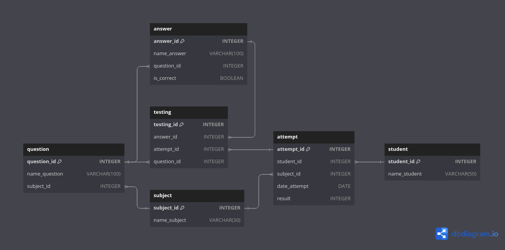

<style>@font-face{font-family:JetBrains; src:url('../00_fonts/JetBrainsMono-Light.ttf');}body{font-family:JetBrains;font-size:15px;}th{background:#1f1f1f;}tr{background:#262626;}.top_button{position:fixed;bottom:1%;left:1%;background-color:#262626;}</style>
<button class="top_button"><a href="#top" style="color: white">^</a></button>

<!-- ~~~~~~~~~~~~~~~~~~~~~~~~~~~~~~~~~~~~~~~~~~~~~~~~~~~~~~~~~~~~~~~~~~~~~~ -->

- [Структура используемой базы данных](#1)

<!-- @@@@@@@@@@@@@@@@@@@@@@@@@@@@@@@@@@@@@@@@@@@@@@@@@@@@@@@@@@@@@@@@@@@@@@ -->

---

<h3 id="1" align="center">Структура используемой базы данных</h3>

<p align="center"></p>

<details><br><summary>Описание таблиц</summary>

<details><br><summary>question</summary>

__question__ - таблица в которой хранится вопрос.
- __question_id__ - уникальный идентификатор вопроса;
- __name_question__ - текст вопроса;
- __subject_id__ - идентификатор дисциплины, к которой относится этот вопрос.
    - каждый вопрос может относиться только к одной дисциплине;
    - [ON DELETE CASCADE].

<hr style="margin-left: 25%; margin-right: 25%;"></details>

<details><br><summary>answer</summary>

__answer__ - таблица в которой хранится вариант ответа на вопрос.
- __answer_id__ - уникальный идентификатор варианта ответа;
- __name_answer__ - текст ответа;
- __question_id__ - идентификатор вопроса, к которому относится этот вариант
  ответа;
    - каждый вариант ответа может относиться только к одному вопросу;
    - [ON DELETE CASCADE].
- __is_correct__ - булево значение, обозначающее является ли этот вариант
  ответа, на вопрос question_id, корректным.

<hr style="margin-left: 25%; margin-right: 25%;"></details>

<details><br><summary>subject</summary>

__subject__ - таблица в которой хранится название дисциплины.
- __subject_id__ - уникальный идентификатор дисциплины;
- __name_subject__ - наименование дисциплины.

<hr style="margin-left: 25%; margin-right: 25%;"></details>

<details><br><summary>attempt</summary>

__attempt__ - таблица в которой хранится информация о попытке студента
ответить на вопрос.
- __attempt_id__ - уникальный идентификатор попытки;
- __student_id__ - идентификатор студента, совершивший попытку;
    - у каждой попытки может быть только один студент;
    - [ON DELETE CASCADE].
- __subject_id__ - идентификатор дисциплины, вопроса;
    - у каждой попытки может быть только одна дисциплина;
    - [ON DELETE CASCADE].
- __date_attempt__ - дата попытки ответить на вопрос;
- __result__ - результат в процентах.

<hr style="margin-left: 25%; margin-right: 25%;"></details>

<details><br><summary>student</summary>

__student__ - таблица в которой хранится информация о студенте.
- __student_id__ - уникальный идентификатор студента;
- __name_student__ - фамилия и имя студента.

<hr style="margin-left: 25%; margin-right: 25%;"></details>

<details><br><summary>testing</summary>

__testing__ - промежуточная таблица для объединения вопроса, варианта ответа и
попыток студента ответить на вопрос.
- __testing_id__ - уникальный идентификатор;
- __question_id__ - идентификатор вопроса;
    - [ON DELETE CASCADE].
- __answer_id__ - идентификатор выбранного студентом варианта ответа;
    - [ON DELETE CASCADE].
- __attempt_id__ - идентификатор попытки;
    - [ON DELETE CASCADE].

</details>

</details>

<!-- @@@@@@@@@@@@@@@@@@@@@@@@@@@@@@@@@@@@@@@@@@@@@@@@@@@@@@@@@@@@@@@@@@@@@@ -->

---

__Задание 1:__

В таблицу attempt включить новую попытку для студента Баранова Павла по
дисциплине «Основы баз данных». Установить текущую дату в качестве даты
выполнения попытки.

<details><br><summary>Таблица attempt до</summary>

|attempt_id|student_id|subject_id|date_attempt|result|
|----------|----------|----------|------------|------|
|1|1|2|2020-03-23|67|
|2|3|1|2020-03-23|100|
|3|4|2|2020-03-26|0|
|4|1|1|2020-04-15|33|
|5|3|1|2020-04-15|67|
|6|4|2|2020-04-21|100|
|7|3|1|2020-05-17|33|

<hr style="margin-left: 25%; margin-right: 25%;"></details>

<details><br><summary>Таблица student и subject</summary>

student

|student_id|name_student||
|----------|------------|-|
|1|Баранов Павел|<font color="green"><-</font>|
|2|Абрамова Катя|
|3|Семенов Иван|
|4|Яковлева Галина|

subject

|subject_id|name_subject||
|----------|------------|-|
|1|Основы SQL|
|2|Основы баз данных|<font color="green"><-</font>|
|3|Физика|

<hr style="margin-left: 25%; margin-right: 25%;"></details><br>

```sql
INSERT INTO attempt(student_id, subject_id, date_attempt, result)
     SELECT student.student_id AS student_id,
            subject.subject_id AS subject_id,
            CURRENT_DATE() AS date_attempt,
            NULL AS result
       FROM student
            INNER JOIN subject
                    ON subject.name_subject LIKE 'основы баз данных'
                   AND student.name_student LIKE 'баранов павел';
```

<details><br><summary>Таблица attempt после</summary>

|attempt_id|student_id|subject_id|date_attempt|result||
|----------|----------|----------|------------|------|-|
|1|1|2|2020-03-23|67|
|2|3|1|2020-03-23|100|
|3|4|2|2020-03-26|0|
|4|1|1|2020-04-15|33|
|5|3|1|2020-04-15|67|
|6|4|2|2020-04-21|100|
|7|3|1|2020-05-17|33|
|8|1|2|2023-11-26|NULL|<font color="green"><-</font>|

</details>

---

__Задание 2:__

Случайным образом выбрать три вопроса по дисциплине, тестирование по которой
собирается проходить студент, занесенный в таблицу attempt последним, и
добавить их в таблицу testing. id последней попытки получить как максимальное
значение id из таблицы attempt.

<details><br><summary>Таблица attempt и question</summary>

attempt

|attempt_id|student_id|subject_id|date_attempt|result||
|----------|----------|----------|------------|------|-|
|1|1|2|2020-03-23|67|
|2|3|1|2020-03-23|100|
|3|4|2|2020-03-26|0|
|4|1|1|2020-04-15|33|
|5|3|1|2020-04-15|67|
|6|4|2|2020-04-21|100|
|7|3|1|2020-05-17|33|
|8|1|2|2023-11-26|NULL|<font color="green"><-</font>|

question

|question_id|name_question|subject_id||
|-----------|-------------|----------|-|
|1|Запрос на выборку начинается с...|1|
|2|Условие, по которому отбираютс...|1|
|3|Для сортировки используется:...|1|
|4|Какой запрос выбирает все запи...|1|
|5|Для внутреннего соединения таб...|1|
|6|База данных - это:...|2|<font color="green"><-</font>|
|7|Отношение - это:...|2|<font color="green"><-</font>|
|8|Концептуальная модель использу...|2|<font color="green"><-</font>|
|9|Какой тип данных не допустим в...|2|<font color="green"><-</font>|

<hr style="margin-left: 25%; margin-right: 25%;"></details>

<details><br><summary>Таблица testing до</summary>

|testing_id|attempt_id|question_id|answer_id|
|----------|----------|-----------|---------|
|1|1|9|25|
|2|1|7|19|
|3|1|6|17|
|4|2|3|9|
|5|2|1|2|
|6|2|4|11|
|7|3|6|18|
|8|3|8|24|
|9|3|9|28|
|10|4|1|2|
|11|4|5|16|
|12|4|3|10|
|13|5|2|6|
|14|5|1|2|
|15|5|4|12|
|16|6|6|17|
|17|6|8|22|
|18|6|7|21|
|19|7|1|3|
|20|7|4|11|
|21|7|5|16|

<hr style="margin-left: 25%; margin-right: 25%;"></details><br>

```sql
INSERT INTO testing(answer_id, attempt_id, question_id)
     SELECT NULL AS answer_id,
            attempt.attempt_id AS attempt_id,
            question.question_id AS question_id
       FROM (  SELECT attempt_id,
                      @subject_id := subject_id
                 FROM attempt
             ORDER BY attempt_id DESC
                LIMIT 1) AS attempt
            INNER JOIN (   SELECT question_id
                             FROM question
                            WHERE subject_id = @subject_id
                         ORDER BY RAND()
                            LIMIT 3) AS question;
```

<details><br><summary>Под-запросы</summary>

```sql
  SELECT attempt_id,
         subject_id
    FROM attempt
ORDER BY attempt_id DESC
   LIMIT 1;
```

|attempt_id|subject_id||
|----------|----------|-|
|8|2|<font color="green"><-</font>|

<p align="center">~~~</p>

```sql
   SELECT *
     FROM question
    WHERE subject_id = 2
 ORDER BY RAND()
    LIMIT 3;
```

|question_id|name_question|subject_id||
|-----------|-------------|----------|-|
|8|Концептуальная модель использу...|2|<font color="green"><-</font>|
|6|База данных - это:...|2|<font color="green"><-</font>|
|7|Отношение - это:...|2|<font color="green"><-</font>|

<hr style="margin-left: 25%; margin-right: 25%;"></details>

<details><br><summary>Таблица testing после</summary>

|testing_id|attempt_id|question_id|answer_id||
|----------|----------|-----------|---------|-|
|1|1|9|25|
|2|1|7|19|
|3|1|6|17|
|4|2|3|9|
|5|2|1|2|
|6|2|4|11|
|7|3|6|18|
|8|3|8|24|
|9|3|9|28|
|10|4|1|2|
|11|4|5|16|
|12|4|3|10|
|13|5|2|6|
|14|5|1|2|
|15|5|4|12|
|16|6|6|17|
|17|6|8|22|
|18|6|7|21|
|19|7|1|3|
|20|7|4|11|
|21|7|5|16|
|22|8|8|NULL|<font color="green"><-</font>|
|23|8|7|NULL|<font color="green"><-</font>|
|24|8|9|NULL|<font color="green"><-</font>|


</details>

---

__Задание 3:__

Студент прошел тестирование (то есть все его ответы занесены в таблицу testing),
далее необходимо вычислить результат и занести его в таблицу attempt для
соответствующей попытки.

Результат попытки вычислить как количество правильных ответов, деленное на 3
(количество вопросов в каждой попытке) и умноженное на 100. Результат округлить
до целого.

Будем считать, что мы знаем id попытки,  для которой вычисляется результат, в
нашем случае это 8. В таблицу testing занесены следующие ответы пользователя:

<details><br><summary>Ответы студента на тест</summary>

|testing_id|answer_id|attempt_id|question_id|is_correct|
|----------|---------|----------|-----------|----------|
|22|26|8|9|0|
|23|17|8|6|1|
|24|22|8|8|1|
|-|-|-|-|<font color="green">Итог: 66.(6)</font>|

<hr style="margin-left: 25%; margin-right: 25%;"></details>

<details><br><summary>Таблица attempt до</summary>

|attempt_id|student_id|subject_id|date_attempt|result||
|----------|----------|----------|------------|------|-|
|1|1|2|2020-03-23|67|
|2|3|1|2020-03-23|100|
|3|4|2|2020-03-26|0|
|4|1|1|2020-04-15|33|
|5|3|1|2020-04-15|67|
|6|4|2|2020-04-21|100|
|7|3|1|2020-05-17|33|
|8|1|2|2023-11-26|NULL|<font color="green">67</font>|

<hr style="margin-left: 25%; margin-right: 25%;"></details><br>

```sql
UPDATE attempt
   SET result = (SELECT ROUND(AVG(answer.is_correct != 0) * 100, 0)
                   FROM answer
                        INNER JOIN testing
                                ON answer.answer_id = testing.answer_id
                               AND testing.attempt_id = 8)
 WHERE attempt_id = 8;
```

<details><br><summary>Под-запрос</summary>

```sql
SELECT ROUND(AVG(answer.is_correct != 0) * 100, 0) AS result
  FROM testing
       INNER JOIN answer USING (answer_id)
 WHERE attempt_id = 8;
```

|result|
|------|
|67|

<hr style="margin-left: 25%; margin-right: 25%;"></details>

<details><br><summary>Таблица attempt после</summary>

|attempt_id|student_id|subject_id|date_attempt|result||
|----------|----------|----------|------------|------|-|
|1|1|2|2020-03-23|67|
|2|3|1|2020-03-23|100|
|3|4|2|2020-03-26|0|
|4|1|1|2020-04-15|33|
|5|3|1|2020-04-15|67|
|6|4|2|2020-04-21|100|
|7|3|1|2020-05-17|33|
|8|1|2|2023-11-26|67|<font color="green"><-</font>|

</details>

---

__Задание 4:__

Удалить из таблицы attempt все попытки, выполненные раньше 1 мая 2020 года.
Также удалить и все соответствующие этим попыткам вопросы из таблицы testing.

<details><br><summary>Таблица attempt до</summary>

|attempt_id|student_id|subject_id|date_attempt|result||
|----------|----------|----------|------------|------|-|
|1|1|2|2020-03-23|67|<font color="red">X</font>|
|2|3|1|2020-03-23|100|<font color="red">X</font>|
|3|4|2|2020-03-26|0|<font color="red">X</font>|
|4|1|1|2020-04-15|33|<font color="red">X</font>|
|5|3|1|2020-04-15|67|<font color="red">X</font>|
|6|4|2|2020-04-21|100|<font color="red">X</font>|
|7|3|1|2020-05-17|33|
|8|1|2|2023-11-26|67|

<hr style="margin-left: 25%; margin-right: 25%;"></details>

<details><br><summary>Таблица testing до</summary>

|testing_id|attempt_id|question_id|answer_id||
|----------|----------|-----------|---------|-|
|1|1|9|25|<font color="red">X</font>|
|2|1|7|19|<font color="red">X</font>|
|3|1|6|17|<font color="red">X</font>|
|4|2|3|9|<font color="red">X</font>|
|5|2|1|2|<font color="red">X</font>|
|6|2|4|11|<font color="red">X</font>|
|7|3|6|18|<font color="red">X</font>|
|8|3|8|24|<font color="red">X</font>|
|9|3|9|28|<font color="red">X</font>|
|10|4|1|2|<font color="red">X</font>|
|11|4|5|16|<font color="red">X</font>|
|12|4|3|10|<font color="red">X</font>|
|13|5|2|6|<font color="red">X</font>|
|14|5|1|2|<font color="red">X</font>|
|15|5|4|12|<font color="red">X</font>|
|16|6|6|17|<font color="red">X</font>|
|17|6|8|22|<font color="red">X</font>|
|18|6|7|21|<font color="red">X</font>|
|19|7|1|3|
|20|7|4|11|
|21|7|5|16|
|22|8|9|26|
|23|8|6|17|
|24|8|8|22|

<hr style="margin-left: 25%; margin-right: 25%;"></details><br>

```sql
DELETE FROM attempt
      WHERE date_attempt < '2020-05-01';
```

<details><br><summary>Таблица attempt после</summary>

|attempt_id|student_id|subject_id|date_attempt|result|
|----------|----------|----------|------------|------|
|7|3|1|2020-05-17|33|
|8|1|2|2023-11-26|67|

<hr style="margin-left: 25%; margin-right: 25%;"></details>

<details><br><summary>Таблица testing после</summary>

|testing_id|attempt_id|question_id|answer_id|
|----------|----------|-----------|---------|
|19|7|1|3|
|20|7|4|11|
|21|7|5|16|
|22|8|9|26|
|23|8|6|17|
|24|8|8|22|

</details>