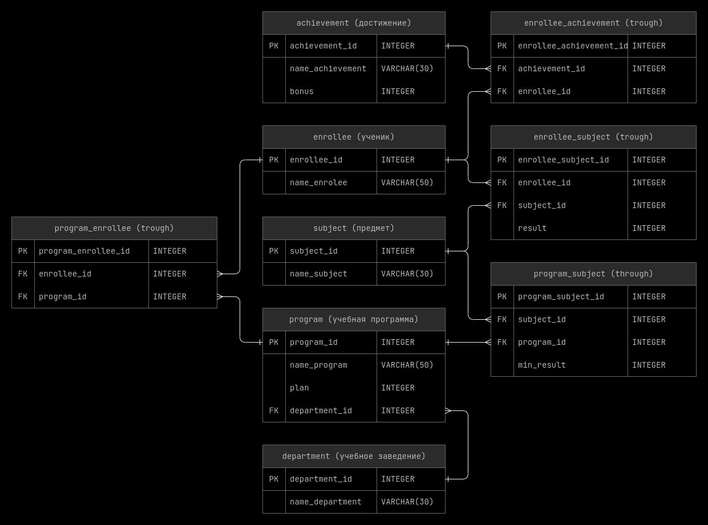

<style>@font-face{font-family:JetBrains; src:url('../00_fonts/JetBrainsMono-Light.ttf');}body{font-family:JetBrains;font-size:15px;}th{background:#1f1f1f;}tr{background:#262626;}.top_button{position:fixed;bottom:1%;left:1%;background-color:#262626;}</style>
<button class="top_button"><a href="#top" style="color: white">^</a></button>

<!-- ~~~~~~~~~~~~~~~~~~~~~~~~~~~~~~~~~~~~~~~~~~~~~~~~~~~~~~~~~~~~~~~~~~~~~~ -->

- [Структура используемой базы данных](#1)
- [Использование IFNULL](#IFNULL)
    - [MySQL IFNULL - tutorial](https://www.mysqltutorial.org/mysql-ifnull/)

<!-- @@@@@@@@@@@@@@@@@@@@@@@@@@@@@@@@@@@@@@@@@@@@@@@@@@@@@@@@@@@@@@@@@@@@@@ -->

---

<h3 id="1" align="center">Структура используемой базы данных</h3>

<p align="center"></p>

<details><br><summary>Описание таблиц</summary>

<details><br><summary>achievement</summary>

__achievement__ - таблица в которой хранятся достижения.
- __achievement_id__ - уникальный идентификатор достижения;
- __name_achievement__ - название достижения;
- __bonus__ - кол-во дополнительных баллов за достижение.

<hr style="margin-left: 25%; margin-right: 25%;"></details>

<details><br><summary>enrollee</summary>

__enrollee__ - таблица в которой хранится информация об абитуриентах(студентах).
- __enrollee_id__ - уникальный идентификатор студента;
- __name_enrollee__ - фамилия и имя студента.

<hr style="margin-left: 25%; margin-right: 25%;"></details>

<details><br><summary>subject</summary>

__subject__ - таблица в которой хранятся предметы.
- __subject_id__ - уникальный идентификатор предмета;
- __name_subject__ - название предмета.

<hr style="margin-left: 25%; margin-right: 25%;"></details>

<details><br><summary>program</summary>

__program__ - таблица в которой хранятся учебные курсы(направления).
- __program_id__ - уникальный идентификатор учебного программы;
- __name_program__ - название учебной программы;
- __plan__ - требуемое кол-во баллов для поступления на эту учебную программу;
- __department_id__ - идентификатор учебного заведения, в котором преподается
  данный курс.
    - каждая учебная программа может преподаваться только в одном учебном
      заведений;
    - [ON DELETE CASCADE].

<hr style="margin-left: 25%; margin-right: 25%;"></details>

<details><br><summary>department</summary>

__department__ - таблица в которой хранятся учебные заведения.
- __department_id__ - уникальный идентификатор учебного заведения;
- __name_department__ - название учебного заведения.

<hr style="margin-left: 25%; margin-right: 25%;"></details>

<details><br><summary>enrollee_achievement</summary>

__enrollee_achievement__ - промежуточная таблица между студентами и достижениями.

- __enrollee_achievement_id__ - уникальный идентификатор;
- __achievement_id__ - идентификатор достижения;
    - [ON DELETE CASCADE]
- __enrollee_id__ - идентификатор студента.
    - [ON DELETE CASCADE]

> - каждое достижение может быть присвоено многим ученикам;
> - у каждого ученика может быть много достижений.

<hr style="margin-left: 25%; margin-right: 25%;"></details>

<details><br><summary>enrollee_subject</summary>

__enrollee_subject__ - промежуточная таблица между студентами и предметами.
- __enrollee_subject_id__ - уникальный идентификатор;
- __enrollee_id__ - идентификатор студента;
    - [ON DELETE CASCADE]
- __subject_id__ - идентификатор предмета;
    - [ON DELETE CASCADE]
- __result__ - балл на который студент сдал предмет.

> - каждый ученик может сдавать много предметов;
> - каждый предмет может сдаваться многими учениками.

<hr style="margin-left: 25%; margin-right: 25%;"></details>

<details><br><summary>program_subject</summary>

__program_subject__ - промежуточная таблица между предметами и учебными
программами.
- __program_subject_id__ - уникальный идентификатор;
- __subject_id__ - идентификатор предмета;
    - [ON DELETE CASCADE]
- __program_id__ - идентификатор учебного программы;
    - [ON DELETE CASCADE]
- __min_result__ - на сколько баллов нужно сдать предмет, что-бы поступить на
  учебную программу.

> - каждый предмет может требоваться для поступления на разные учебные программы;
> - для поступления на одну учебную программу может потребоваться сдача многих
    предметов.

<hr style="margin-left: 25%; margin-right: 25%;"></details>

<details><br><summary>program_enrollee</summary>

__program_enrollee__ - промежуточная таблица между учебными программами и
студентами.
- __program_enrollee_id__ - уникальный идентификатор;
- __enrollee_id__ - идентификатор студента;
    - [ON DELETE CASCADE]
- __program_id__ - идентификатор учебного программы.
    - [ON DELETE CASCADE]

> - каждый студент может изучать много учебных программ;
> - каждую учебную программу могут изучать много студентов.

</details>

</details>

<!-- @@@@@@@@@@@@@@@@@@@@@@@@@@@@@@@@@@@@@@@@@@@@@@@@@@@@@@@@@@@@@@@@@@@@@@ -->

---

__Задание 1:__

Вывести абитуриентов, которые хотят поступать на образовательную программу
«Мехатроника и робототехника» в отсортированном по фамилиям виде.

```sql
  SELECT enrollee.name_enrollee
    FROM program_enrollee
         INNER JOIN program
                 ON program_enrollee.program_id = program.program_id
                AND program.name_program LIKE 'мехатроника и робототехника'
         INNER JOIN enrollee USING (enrollee_id)
ORDER BY enrollee.name_enrollee ASC;
```

|name_enrollee|
|-------------|
|Баранов Павел|
|Попов Илья|
|Семенов Иван|
|Степанова Дарья|

---

__Задание 2:__

Вывести образовательные программы, на которые для поступления необходим предмет
«Информатика». Программы отсортировать в обратном алфавитном порядке.

```sql
  SELECT program.name_program
    FROM program_subject
         INNER JOIN subject
                 ON program_subject.subject_id = subject.subject_id
                AND subject.name_subject LIKE 'информатика'
         INNER JOIN program USING (program_id)
ORDER BY program.name_program DESC;
```

|name_program|
|------------|
|Прикладная математика и информатика|
|Математика и компьютерные науки|

---

__Задание 3:__

Выведите количество абитуриентов, сдавших ЕГЭ по каждому предмету, максимальное,
минимальное и среднее значение баллов по предмету ЕГЭ. Вычисляемые столбцы
назвать Количество, Максимум, Минимум, Среднее. Информацию отсортировать по
названию предмета в алфавитном порядке, среднее значение округлить до одного
знака после запятой.

```sql
  SELECT subject.name_subject,
         COUNT(*) AS Количество,
         MAX(enrollee_subject.result) AS Максимум,
         MIN(enrollee_subject.result) AS Минимум,
         ROUND(AVG(enrollee_subject.result), 1) AS Среднее
    FROM enrollee_subject
         INNER JOIN subject USING (subject_id)
GROUP BY subject.name_subject
ORDER BY subject.name_subject ASC;
```

|name_subject|Количество|Максимум|Минимум|Среднее|
|------------|----------|--------|-------|-------|
|Информатика|4|94|75|82.0|
|Математика|6|92|67|75.3|
|Русский язык|6|90|65|77.5|
|Физика|5|90|41|69.8|

---

__Задание 4:__

Вывести образовательные программы, для которых минимальный балл ЕГЭ по каждому
предмету больше или равен 40 баллам. Программы вывести в отсортированном по
алфавиту виде.

```sql
  SELECT program.name_program
    FROM program
         INNER JOIN program_subject USING (program_id)
GROUP BY program.name_program
  HAVING MIN(program_subject.min_result) >= 40
ORDER BY program.name_program ASC;
```

|name_program|
|------------|
|Мехатроника и робототехника|
|Прикладная математика и информатика|

---

__Задание 5:__

Вывести образовательные программы, которые имеют самый большой план набора,
вместе с этой величиной.

<details><br><summary>Под-запрос</summary>

```sql
SELECT MAX(plan)
  FROM program;
```

|MAX(plan)|
|---------|
|3|

<hr style="margin-left: 25%; margin-right: 25%;"></details><br>

```sql
SELECT name_program,
       plan
  FROM program
 WHERE plan = (SELECT MAX(plan)
                 FROM program);
```

|name_program|plan|
|------------|----|
|Мехатроника и робототехника|3|

---

__Задание 6:__

Посчитать, сколько дополнительных баллов получит каждый абитуриент. Столбец с
дополнительными баллами назвать Бонус. Информацию вывести в отсортированном по
фамилиям виде.

<p id="IFNULL"></p>

```sql
  SELECT enrollee.name_enrollee,
         IFNULL(SUM(achievement.bonus), 0) AS Бонус
    FROM achievement
         INNER JOIN enrollee_achievement USING (achievement_id)
         RIGHT JOIN enrollee USING (enrollee_id)
GROUP BY enrollee_achievement.enrollee_id,
         enrollee.name_enrollee
ORDER BY enrollee.name_enrollee ASC;
```

|name_enrollee|Бонус|
|-------------|-----|
|Абрамова Катя|0|
|Баранов Павел|6|
|Попов Илья|8|
|Семенов Иван|5|
|Степанова Дарья|0|
|Яковлева Галина|1|

---

__Задание 7:__

Выведите сколько человек подало заявление на каждую образовательную программу и
конкурс на нее (число поданных заявлений деленное на количество мест по плану),
округленный до 2-х знаков после запятой. В запросе вывести название факультета,
к которому относится образовательная программа, название образовательной
программы, план набора абитуриентов на образовательную программу (plan),
количество поданных заявлений (Количество) и Конкурс. Информацию отсортировать
в порядке убывания конкурса.

```sql
  SELECT department.name_department,
         program.name_program,
         program.plan,
         COUNT(*) AS Количество,
         ROUND(COUNT(*) / program.plan, 2) AS Конкурс
    FROM program_enrollee
         INNER JOIN program USING (program_id)
         INNER JOIN department USING (department_id)
GROUP BY program_enrollee.program_id
ORDER BY Конкурс DESC;
```

|name_department|name_program|plan|Количество|Конкурс|
|---------------|------------|----|----------|-------|
|Школа естественных наук|Математика и компьютерные науки|1|3|3.00|
|Инженерная школа|Прикладная механика|2|4|2.00|
|Школа естественных наук|Прикладная математика и информатика|2|3|1.50|
|Инженерная школа|Мехатроника и робототехника|3|4|1.33|

---

__Задание 8:__

Вывести образовательные программы, на которые для поступления необходимы
предмет «Информатика» и «Математика» в отсортированном по названию программ
виде.

```sql
  SELECT program.name_program
    FROM program_subject
         INNER JOIN subject
                 ON program_subject.subject_id = subject.subject_id
                AND REGEXP_LIKE(subject.name_subject, '(информатика|математика)', 'i') 
         INNER JOIN program USING (program_id)
GROUP BY program_subject.program_id
  HAVING COUNT(*) = 2
ORDER BY program.name_program;
```

|name_program|
|------------|
|Математика и компьютерные науки|
|Прикладная математика и информатика|

---

__Задание 9:__

Посчитать количество баллов каждого абитуриента на каждую образовательную
программу, на которую он подал заявление, по результатам ЕГЭ. В результат
включить название образовательной программы, фамилию и имя абитуриента, а также
столбец с суммой баллов, который назвать itog. Информацию вывести в
отсортированном сначала по образовательной программе, а потом по убыванию суммы
баллов виде.

```sql
  SELECT program.name_program,
         enrollee.name_enrollee,
         SUM(enrollee_subject.result) AS itog
    FROM enrollee
         INNER JOIN program_enrollee USING (enrollee_id)
         INNER JOIN program USING (program_id)
         INNER JOIN program_subject USING (program_id)
         INNER JOIN enrollee_subject USING (enrollee_id, subject_id)
GROUP BY program_enrollee.enrollee_id,
         program_enrollee.program_id
ORDER BY program.name_program ASC,
         itog DESC;
```

|name_program|name_enrollee|itog|
|------------|-------------|----|
|Математика и компьютерные науки|Степанова Дарья|276|
|Математика и компьютерные науки|Семенов Иван|230|
|Математика и компьютерные науки|Абрамова Катя|226|
|Мехатроника и робототехника|Степанова Дарья|270|
|Мехатроника и робототехника|Семенов Иван|242|
|Мехатроника и робототехника|Попов Илья|192|
|Мехатроника и робототехника|Баранов Павел|179|
|Прикладная математика и информатика|Семенов Иван|230|
|Прикладная математика и информатика|Абрамова Катя|226|
|Прикладная математика и информатика|Баранов Павел|213|
|Прикладная механика|Степанова Дарья|270|
|Прикладная механика|Яковлева Галина|238|
|Прикладная механика|Попов Илья|192|
|Прикладная механика|Баранов Павел|179|

---

__Задание 10:__

Вывести название образовательной программы и фамилию тех абитуриентов, которые
подавали документы на эту образовательную программу, но не могут быть зачислены
на нее. Эти абитуриенты имеют результат по одному или нескольким предметам ЕГЭ,
необходимым для поступления на эту образовательную программу, меньше
минимального балла. Информацию вывести в отсортированном сначала по программам,
а потом по фамилиям абитуриентов виде.

```sql
  SELECT program.name_program,
         enrollee.name_enrollee
    FROM program_enrollee
         INNER JOIN program USING (program_id)
         INNER JOIN program_subject USING (program_id)
         INNER JOIN enrollee USING (enrollee_id)
         INNER JOIN enrollee_subject USING (enrollee_id, subject_id)
   WHERE enrollee_subject.result < program_subject.min_result
ORDER BY program.name_program ASC,
         enrollee.name_enrollee ASC;
```

|name_program|name_enrollee|
|------------|-------------|
|Мехатроника и робототехника|Баранов Павел|
|Прикладная механика|Баранов Павел|
