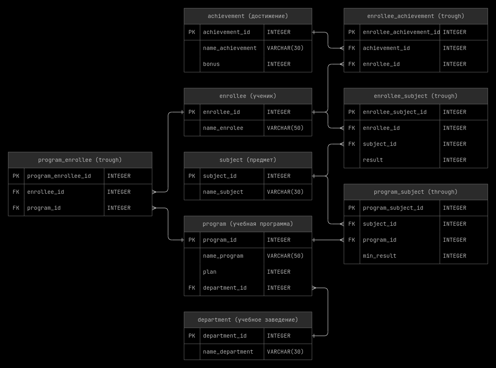

<style>@font-face{font-family:JetBrains; src:url('../00_fonts/JetBrainsMono-Light.ttf');}body{font-family:JetBrains;font-size:15px;}th{background:#1f1f1f;}tr{background:#262626;}.top_button{position:fixed;bottom:1%;left:1%;background-color:#262626;}</style>
<button class="top_button"><a href="#top" style="color: white">^</a></button>

<!-- ~~~~~~~~~~~~~~~~~~~~~~~~~~~~~~~~~~~~~~~~~~~~~~~~~~~~~~~~~~~~~~~~~~~~~~ -->

- [Структура используемой базы данных](#1)

<!-- @@@@@@@@@@@@@@@@@@@@@@@@@@@@@@@@@@@@@@@@@@@@@@@@@@@@@@@@@@@@@@@@@@@@@@ -->

---

<h3 id="1" align="center">Структура используемой базы данных</h3>

<p align="center"></p>

<details><br><summary>Описание таблиц</summary>

<details><br><summary>achievement</summary>

__achievement__ - таблица в которой хранятся достижения.
- __achievement_id__ - уникальный идентификатор достижения;
- __name_achievement__ - название достижения;
- __bonus__ - кол-во дополнительных баллов за достижение.

<hr style="margin-left: 25%; margin-right: 25%;"></details>

<details><br><summary>enrollee</summary>

__enrollee__ - таблица в которой хранится информация об абитуриентах(студентах).
- __enrollee_id__ - уникальный идентификатор студента;
- __name_enrollee__ - фамилия и имя студента.

<hr style="margin-left: 25%; margin-right: 25%;"></details>

<details><br><summary>subject</summary>

__subject__ - таблица в которой хранятся предметы.
- __subject_id__ - уникальный идентификатор предмета;
- __name_subject__ - название предмета.

<hr style="margin-left: 25%; margin-right: 25%;"></details>

<details><br><summary>program</summary>

__program__ - таблица в которой хранятся учебные курсы(направления).
- __program_id__ - уникальный идентификатор учебного программы;
- __name_program__ - название учебной программы;
- __plan__ - кол-во доступных мест на данную учебную программу;
- __department_id__ - идентификатор учебного заведения, в котором преподается
  данный курс.
    - каждая учебная программа может преподаваться только в одном учебном
      заведений;
    - [ON DELETE CASCADE].

<hr style="margin-left: 25%; margin-right: 25%;"></details>

<details><br><summary>department</summary>

__department__ - таблица в которой хранятся учебные заведения.
- __department_id__ - уникальный идентификатор учебного заведения;
- __name_department__ - название учебного заведения.

<hr style="margin-left: 25%; margin-right: 25%;"></details>

<details><br><summary>enrollee_achievement</summary>

__enrollee_achievement__ - промежуточная таблица между студентами и достижениями.

- __enrollee_achievement_id__ - уникальный идентификатор;
- __achievement_id__ - идентификатор достижения;
    - [ON DELETE CASCADE]
- __enrollee_id__ - идентификатор студента.
    - [ON DELETE CASCADE]

> - каждое достижение может быть присвоено многим ученикам;
> - у каждого ученика может быть много достижений.

<hr style="margin-left: 25%; margin-right: 25%;"></details>

<details><br><summary>enrollee_subject</summary>

__enrollee_subject__ - промежуточная таблица между студентами и предметами.
- __enrollee_subject_id__ - уникальный идентификатор;
- __enrollee_id__ - идентификатор студента;
    - [ON DELETE CASCADE]
- __subject_id__ - идентификатор предмета;
    - [ON DELETE CASCADE]
- __result__ - балл на который студент сдал предмет.

> - каждый ученик может сдавать много предметов;
> - каждый предмет может сдаваться многими учениками.

<hr style="margin-left: 25%; margin-right: 25%;"></details>

<details><br><summary>program_subject</summary>

__program_subject__ - промежуточная таблица между предметами и учебными
программами.
- __program_subject_id__ - уникальный идентификатор;
- __subject_id__ - идентификатор предмета;
    - [ON DELETE CASCADE]
- __program_id__ - идентификатор учебного программы;
    - [ON DELETE CASCADE]
- __min_result__ - на сколько баллов нужно сдать предмет, что-бы поступить на
  учебную программу.

> - каждый предмет может требоваться для поступления на разные учебные программы;
> - для поступления на одну учебную программу может потребоваться сдача многих
    предметов.

<hr style="margin-left: 25%; margin-right: 25%;"></details>

<details><br><summary>program_enrollee</summary>

__program_enrollee__ - промежуточная таблица между учебными программами и
студентами.
- __program_enrollee_id__ - уникальный идентификатор;
- __enrollee_id__ - идентификатор студента;
    - [ON DELETE CASCADE]
- __program_id__ - идентификатор учебного программы.
    - [ON DELETE CASCADE]

> - каждый студент может изучать много учебных программ;
> - каждую учебную программу могут изучать много студентов.

</details>

</details>

<!-- @@@@@@@@@@@@@@@@@@@@@@@@@@@@@@@@@@@@@@@@@@@@@@@@@@@@@@@@@@@@@@@@@@@@@@ -->

---

__Задание 1:__

Создать вспомогательную таблицу applicant, куда включить id образовательной
программы, id абитуриента, сумму баллов абитуриентов (столбец itog) в
отсортированном сначала по id образовательной программы, а потом по убыванию
суммы баллов виде (использовать запрос из предыдущего урока).

```sql
CREATE TABLE applicant
      SELECT program.program_id,
             enrollee.enrollee_id,
             SUM(enrollee_subject.result) AS itog
        FROM enrollee
             INNER JOIN program_enrollee USING (enrollee_id)
             INNER JOIN program USING (program_id)
             INNER JOIN program_subject USING (program_id)
             INNER JOIN enrollee_subject USING (enrollee_id, subject_id)
    GROUP BY program_enrollee.enrollee_id,
             program_enrollee.program_id
    ORDER BY program_enrollee.program_id ASC,
             itog DESC;
```

<details><br><summary>Таблица applicant</summary>

```sql
SELECT * FROM applicant;
```

|program_id|enrollee_id|itog|
|----------|-----------|----|
|1|3|230|
|1|2|226|
|1|1|213|
|2|6|276|
|2|3|230|
|2|2|226|
|3|6|270|
|3|4|238|
|3|5|192|
|3|1|179|
|4|6|270|
|4|3|242|
|4|5|192|
|4|1|179|

</details>

---

__Задание 2:__

Из таблицы applicant, созданной на предыдущем шаге, удалить записи, если
абитуриент на выбранную образовательную программу не набрал минимального балла
хотя бы по одному предмету.

<details><br><summary>Под-запрос</summary>

```sql
SELECT program_id,
       enrollee_id,
       itog
  FROM applicant
       INNER JOIN program_subject USING (program_id)
       INNER JOIN enrollee_subject USING (enrollee_id, subject_id)
 WHERE enrollee_subject.result < program_subject.min_result;
```

|program_id|enrollee_id|itog|
|----------|-----------|----|
|3|1|179|
|4|1|179|

<hr style="margin-left: 25%; margin-right: 25%;"></details><br>

```sql
DELETE FROM applicant
      USING applicant
            INNER JOIN program_subject USING (program_id)
            INNER JOIN enrollee_subject USING (enrollee_id, subject_id)
      WHERE enrollee_subject.result < program_subject.min_result;
```

<details><br><summary>Таблица applicant до</summary>

|program_id|enrollee_id|itog||
|----------|-----------|----|-|
|1|3|230|
|1|2|226|
|1|1|213|
|2|6|276|
|2|3|230|
|2|2|226|
|3|6|270|
|3|4|238|
|3|5|192|
|3|1|179|<font color="red">X</font>|
|4|6|270|
|4|3|242|
|4|5|192|
|4|1|179|<font color="red">X</font>|

<hr style="margin-left: 25%; margin-right: 25%;"></details>

<details><br><summary>Таблица applicant после</summary>

|program_id|enrollee_id|itog|
|----------|-----------|----|
|1|3|230|
|1|2|226|
|1|1|213|
|2|6|276|
|2|3|230|
|2|2|226|
|3|6|270|
|3|4|238|
|3|5|192|
|4|6|270|
|4|3|242|
|4|5|192|

</details>

---

__Задание 3:__

Повысить итоговые баллы абитуриентов в таблице applicant на значения
дополнительных баллов.

<details><br><summary>Под-запрос</summary>

```sql
  SELECT enrollee.enrollee_id,
         SUM(achievement.bonus) AS bonus
    FROM achievement
         INNER JOIN enrollee_achievement USING (achievement_id)
         INNER JOIN enrollee USING (enrollee_id)
GROUP BY enrollee.enrollee_id;
```

|enrollee_id|bonus|
|-----------|-----|
|3|5|
|5|8|
|1|6|
|4|1|

<hr style="margin-left: 25%; margin-right: 25%;"></details><br>

```sql
UPDATE applicant
       INNER JOIN (  SELECT enrollee.enrollee_id,
                            SUM(achievement.bonus) AS bonus
                       FROM achievement
                            INNER JOIN enrollee_achievement USING (achievement_id)
                            INNER JOIN enrollee USING (enrollee_id)
                   GROUP BY enrollee.enrollee_id) AS temp USING (enrollee_id)
   SET applicant.itog = applicant.itog + temp.bonus;
```

<details><br><summary>Таблица applicant до</summary>

|program_id|enrollee_id|itog||
|----------|-----------|----|-|
|1|3|230|<font color="green">+5</font>|
|1|2|226|<font color="yellow">+0</font>|
|1|1|213|<font color="green">+6</font>|
|2|6|276|<font color="yellow">+0</font>|
|2|3|230|<font color="green">+5</font>|
|2|2|226|<font color="yellow">+0</font>|
|3|6|270|<font color="yellow">+0</font>|
|3|4|238|<font color="green">+1</font>|
|3|5|192|<font color="green">+8</font>|
|4|6|270|<font color="yellow">+0</font>|
|4|3|242|<font color="green">+5</font>|
|4|5|192|<font color="green">+8</font>|

<hr style="margin-left: 25%; margin-right: 25%;"></details>

<details><br><summary>Таблица applicant после</summary>

|program_id|enrollee_id|itog||
|----------|-----------|----|-|
|1|3|235|<font color="green">230 + 5</font>|
|1|2|226|<font color="yellow">226 + 0 </font>|
|1|1|219|<font color="green">213 + 6</font>|
|2|6|276|<font color="yellow">276 + 0 </font>|
|2|3|235|<font color="green">230 + 5</font>|
|2|2|226|<font color="yellow">226 + 0 </font>|
|3|6|270|<font color="yellow">270 + 0 </font>|
|3|4|239|<font color="green">238 + 1</font>|
|3|5|200|<font color="green">192 + 8</font>|
|4|6|270|<font color="yellow">270 + 0 </font>|
|4|3|247|<font color="green">242 + 5</font>|
|4|5|200|<font color="green">192 + 8</font>|

</details>

---

__Задание 4:__

Поскольку при добавлении дополнительных баллов, абитуриенты по каждой
образовательной программе могут следовать не в порядке убывания суммарных
баллов, необходимо создать новую таблицу applicant_order на основе таблицы
applicant. При создании таблицы данные нужно отсортировать сначала по id
образовательной программы, потом по убыванию итогового балла. А таблицу
applicant, которая была создана как вспомогательная, необходимо удалить.

```sql
CREATE TABLE applicant_order
      SELECT program_id,
             enrollee_id,
             itog
        FROM applicant
    ORDER BY program_id ASC,
             itog DESC;

DROP TABLE applicant;
```

<details><br><summary>Таблица applicant_order</summary>

|program_id|enrollee_id|itog|
|----------|-----------|----|
|1|3|235|
|1|2|226|
|1|1|219|
|2|6|276|
|2|3|235|
|2|2|226|
|3|6|270|
|3|4|239|
|3|5|200|
|4|6|270|
|4|3|247|
|4|5|200|

</details>

---

__Задание 5:__

Включить в таблицу applicant_order новый столбец str_id целого типа ,
расположить его перед первым.

```sql
ALTER TABLE applicant_order
 ADD COLUMN str_id INTEGER FIRST;
```

<details><br><summary>Таблица applicant_order до</summary>

|program_id|enrollee_id|itog|
|----------|-----------|----|
|1|3|235|
|1|2|226|
|1|1|219|
|2|6|276|
|2|3|235|
|2|2|226|
|3|6|270|
|3|4|239|
|3|5|200|
|4|6|270|
|4|3|247|
|4|5|200|

<hr style="margin-left: 25%; margin-right: 25%;"></details>

<details><br><summary>Таблица applicant_order после</summary>

|str_id|program_id|enrollee_id|itog|
|------|----------|-----------|----|
|NULL|1|3|235|
|NULL|1|2|226|
|NULL|1|1|219|
|NULL|2|6|276|
|NULL|2|3|235|
|NULL|2|2|226|
|NULL|3|6|270|
|NULL|3|4|239|
|NULL|3|5|200|
|NULL|4|6|270|
|NULL|4|3|247|
|NULL|4|5|200|

<hr style="margin-left: 25%; margin-right: 25%;"></details>

<p align="center"></p>

<details><br><summary>Поля таблицы applicant_order до</summary>

|Field|Type|Null|Key|Default|Extra|
|-----|----|----|---|-------|-----|
|program_id|int|NO||0||
|enrollee_id|int|NO||0||
|itog|decimal(32,0)|YES||NULL||

<hr style="margin-left: 25%; margin-right: 25%;"></details>

<details><br><summary>Поля таблицы applicant_order после</summary>

|Field|Type|Null|Key|Default|Extra||
|-----|----|----|---|-------|-----|-|
|str_id|int|YES||NULL||<font color="green"><-</font>|
|program_id|int|NO||0||
|enrollee_id|int|NO||0||
|itog|decimal(32,0)|YES||NULL||

</details>

---

__Задание 6:__

Занести в столбец str_id таблицы applicant_order нумерацию абитуриентов, которая
начинается с 1 для каждой образовательной программы.

Занести в столбец str_id таблицы applicant_order нумерацию абитуриентов, которая
начинается с 1 для каждой образовательной программы.

```sql
SET @program_id := 1, @str_id := 0;

UPDATE applicant_order
   SET str_id = IF(@program_id = program_id,
                   @str_id := @str_id + 1,
                   @str_id := 1 AND @program_id := @program_id + 1);
```

<details><br><summary>Таблица applicant_order до и после</summary>

|str_id|program_id|enrollee_id|itog|<font color="green">-></font>|str_id|program_id|enrollee_id|itog|
|------|----------|-----------|----|-|------|----------|-----------|----|
|NULL|1|3|235|<font color="green">-></font>|1|1|3|235|
|NULL|1|2|226|<font color="green">-></font>|2|1|2|226|
|NULL|1|1|219|<font color="green">-></font>|3|1|1|219|
|NULL|2|6|276|<font color="green">-></font>|1|2|6|276|
|NULL|2|3|235|<font color="green">-></font>|2|2|3|235|
|NULL|2|2|226|<font color="green">-></font>|3|2|2|226|
|NULL|3|6|270|<font color="green">-></font>|1|3|6|270|
|NULL|3|4|239|<font color="green">-></font>|2|3|4|239|
|NULL|3|5|200|<font color="green">-></font>|3|3|5|200|
|NULL|4|6|270|<font color="green">-></font>|1|4|6|270|
|NULL|4|3|247|<font color="green">-></font>|2|4|3|247|
|NULL|4|5|200|<font color="green">-></font>|3|4|5|200|

</details>

---

__Задание 7:__

Создать таблицу student,  в которую включить абитуриентов, которые могут быть
рекомендованы к зачислению  в соответствии с планом набора. Информацию
отсортировать сначала в алфавитном порядке по названию программ, а потом по
убыванию итогового балла.

```sql
CREATE TABLE student
      SELECT program.name_program,
             enrollee.name_enrollee,
             applicant_order.itog
        FROM applicant_order
             INNER JOIN program
                     ON applicant_order.program_id = program.program_id
                    AND applicant_order.str_id <= program.plan
             INNER JOIN enrollee USING (enrollee_id)
    ORDER BY program.name_program ASC,
             applicant_order.itog DESC;
```

|name_program|name_enrollee|itog|
|------------|-------------|----|
|Математика и компьютерные науки|Степанова Дарья|276|
|Мехатроника и робототехника|Степанова Дарья|270|
|Мехатроника и робототехника|Семенов Иван|247|
|Мехатроника и робототехника|Попов Илья|200|
|Прикладная математика и информатика|Семенов Иван|235|
|Прикладная математика и информатика|Абрамова Катя|226|
|Прикладная механика|Степанова Дарья|270|
|Прикладная механика|Яковлева Галина|239|
